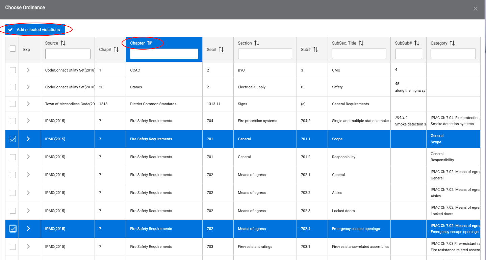
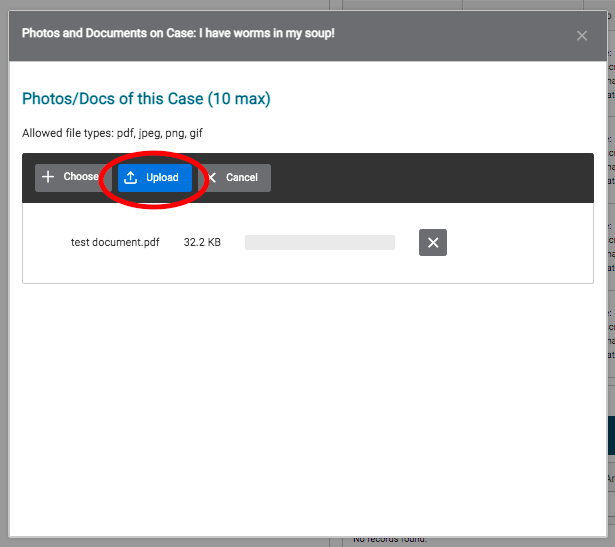

# Code Enforcement Case Management

The CE Case screen enables you to update and track every aspect of a specific code enforcement case. 

To navigate to the specific panel you want to update, you can scroll down or use the hyperlinks at the top of the page.

From this page, you can:

- Add, View, and Edit Violations
- Prepare and Print Notices of Violation
- Prepare and Print Private Criminal Citations
- Log and Edit Events 
- View Upcoming Events
- Upload Photos and Documents
- Manage Fees and Payments
- Add Notes

## Add a Violation

1. Select 'Add Violation' under the Code Violations panel.

2. Locate the Ordinance that was violated. Use the arrows next to each column heading to sort the columns alphabetically and type into the text boxes to make it easier to find the ordinance you are looking for. Click the arrows in the far left column to display details about each ordinance. Once you have found the ordinance you are looking for, hit the 'Select' button.

3. Scroll to the bottom of the Record New Code Violation panel to enter a Description of the code violation. Click the 'Record Violation' button.

## Log an Event

This space allows you to log any type of introduction, communication, interaction, meeting or other event that happened throughout the timeline of the violation. 

1. To add an event, select the type from the menu shown below:

2. Next, select the event category from the second menu on the right-hand side. 

3. After you’ve selected the type and category of the event, fill in the informational boxes below with as much information as you have. 

4. Once you have all the information filled in, click ‘Create new event’ to attach this event to the case you’ve created. 

5. After the event is saved, it will populate in the original list on the case page. 

## Edit an Event

If a mistake was made in recording the event or you have additional information, find the event in the list and select ‘Modify’.

Once the window pops up, add or edit any information you’d like. 

If you made a mistake in the type or category, please delete the event and create a new one. To delete any event, find the event in the list and select ‘View’.

## Upload Files and Photos

1. Select the 'Add Photo or Document' button.

2. Click the 'Choose' button to select the file you would like to upload.

3. Select the blue 'Upload' button to upload the file to the system.

4. Navigate to your uploaded document at the bottom of the Files and Photos panel, and select 'edit' under the Actions column to add a title and description for your document.

