# Code Enforcement Case Management

The CE Case screen enables you to update and track all aspects of a specific code enforcement case. 

To navigate to the specific panel you want to update, scroll down or use the hyperlinks at the top of the page.

From this page, you can:

- [Add, View, and Edit Violations](#Add-a-Violation)
- [Conduct Field Inspections](#Conduct-a-Field-Inspection)
- [Prepare and Print Notices of Violation and Other Letters](#Prepare-a-Notice-of-Violation)
- [Manage Letter Types](#Manage-Letter-Types) 
- [Log, Edit and View Events](#Log-an-Event)
- [Upload Photos and Documents](#Upload-Files-and-Photos)

## Add a Violation

1. Select 'Add Violation' under the Code Violations panel.

2. Locate the Ordinance that was violated. Use the arrows next to each column heading to sort the columns alphabetically and type into the text boxes to make it easier to find the ordinance you are looking for. Click the arrows in the far left column to display details about each ordinance. Once you have found the ordinance you are looking for, select the corresponding checkbox and click 'Add selected violations'. To select multiple ordinances in order to enter multiple violations at once, use the checkboxes in the far left column.

3. Scroll to the bottom of the Record New Code Violation panel to enter a Description of the code violation. Click the 'Record Violation' button.

## Conduct a Field Inspection

1. From the code enforcement case page, select the '+ New inspection' button under the 'Field Inspection' banner. 

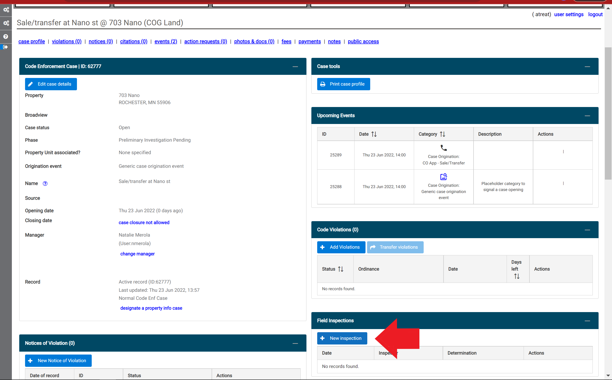

2. Choose the inspection checklist that you want to use and select the 'Create' button.

3. Enter the inspector, date, and time of the inspection, and any notes, in the 'Inspection Profile' pop-up window.  Select the 'Save Changes' button.  

4. Select the 'Inspect new space' button.  

5. Select the space(s) and click 'Continue'.

6. You can choose to add a location descriptor. To start the inspection, select the 'Inspect spance now!' button.

7. All of the code elements within the inspection list will default to 'Not Inspected'. If you would like, you can batch apply the 'Passed' or 'Violated' status to all of the code elements in the list by selecting the status from the drop-down menu in the top left-hand side of the pop-up window and select the 'Batch apply to all ords' link.

8. Code elements in the inspection list are divided into subcategories. Select the arrow next to a subcategory (red circle) to display the associated code elements.  To add a photo, select the 'Add a photo' link (red arrow). 

9. After selecting the 'Add a photo' link in step 8, a pop-up window will appear. To add a photo that is saved on the device, select the '+ Choose' button. 

10. Once you are done selecting files, click the blue 'Upload' button. 

If your upload is successful, the blue 'Upload' button will dissapear and confirmation will temporarily appear for each file that was uploaded. 

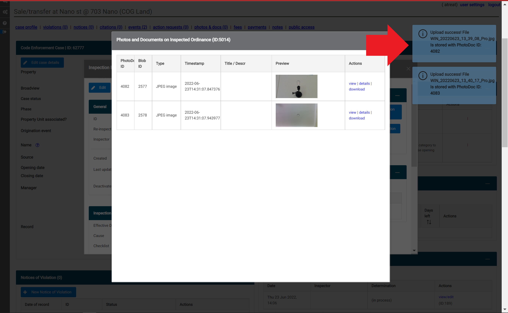

11. To complete the inspection checklist, select 'Save and confirm' at the top of the window. 

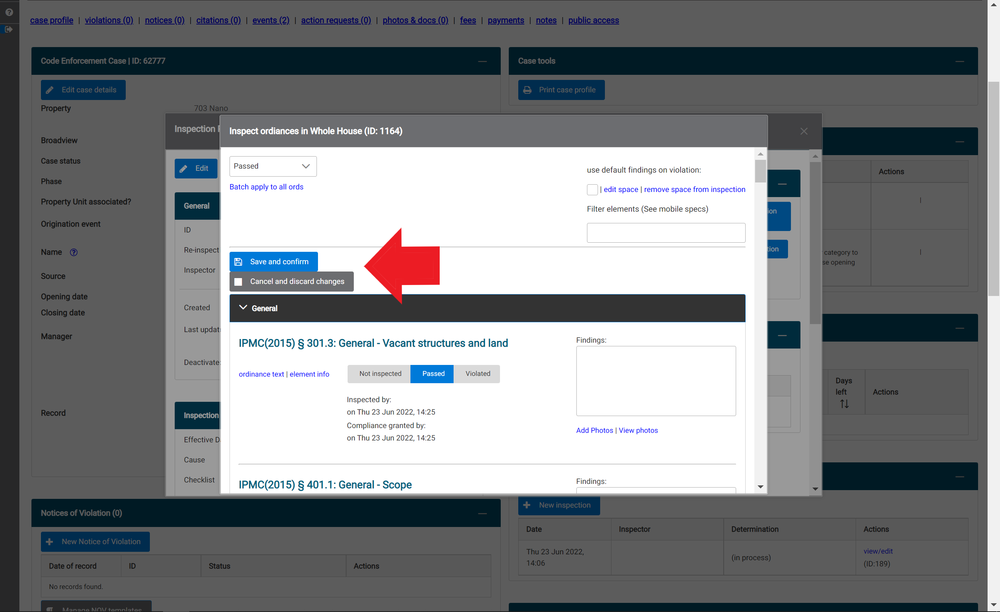

12. If the inspection contained any violations, a pop-up window will appear to prompt you to indicate the severity. Choose the appropiate severyity from the drop-down menu, then select 'Save violation details'.  

## Inspection Toolbox

The Inspection Toolbox contains options to:

- [Finalize your inspection](#Finalize-an-Inspection)
- [Build a printable inspection report](#Generate-a-Field-Inspection-Report)
- [Transfer inspected violations to a new or existing case](#Add-Inspected-Violations-to-Case)

## Finalize an Inspection

1. After saving an inspection checklist, you can finalize the inspection by selecting the blue 'finalize inspection' button. 

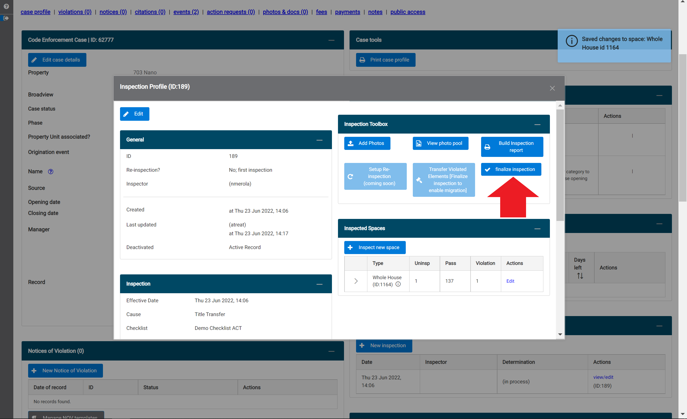

2. Select the correct determination/result of the inspection from the drop-down menu by clicking the down arrow. Then select the 'Finalize and lock inspection ID' blue button. After this button has been selected, you will no longer be able to make any changes to the inspection.

## Generate a Field Inspection Report

1. Select the blue 'Build Inspection Report' button (red arrow).

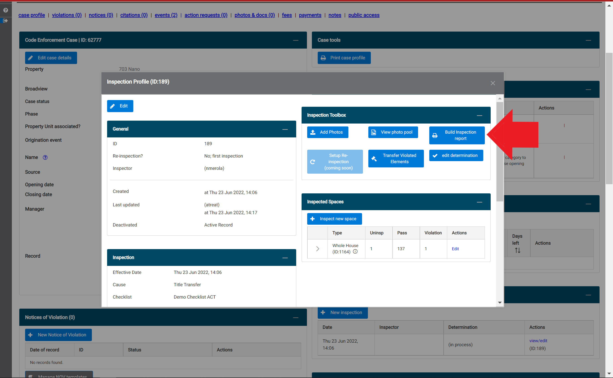

2. Select which elements of the inspection you want to be included in the report from the drop-down menu (red circle) and check any relevant boxes.  Once you are finished, click the 'Click to generate inspection report in new tabe' blue text at the top of the pop-up window. The report will appear in a new tab in a print-friendly format. (Note: It is recommended to remove Headers and Footers on your print settings and adjust the scale as needed.)

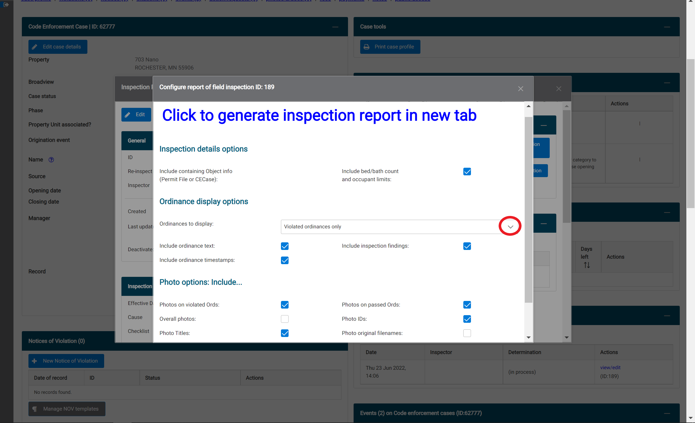

## Add Inspected Violations to Case

1. After an inspection has been finalized, you can transfer the violations that were found to your case so that you do not need to re-enter them. To do this, select 'Transfer Violated Elements' in the Inspection Toolbox.

2. Select that you would like to add violations to an existing case.

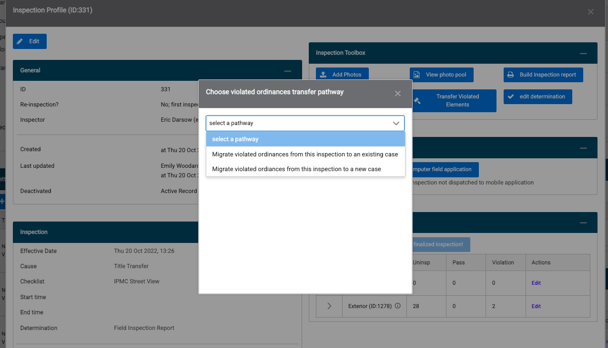

3. Review the violations and enter case details to complete the transfer.

## Prepare a Notice of Violation

1. From the case screen, select 'New Letter'.

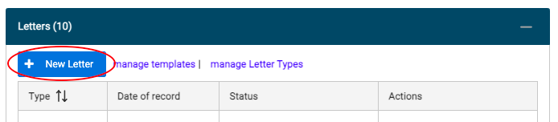

2. Select "Notice of Violation" in the drop down menu.

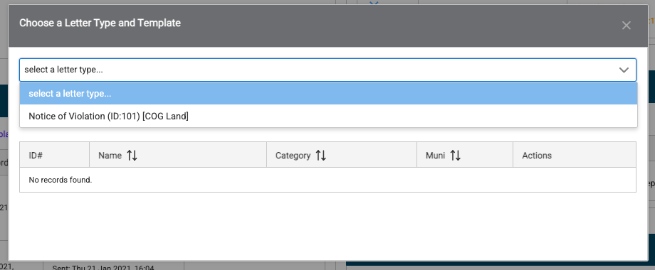

3. Choose a Notice of Violation Template. This template has the prefilled text body to create the NOV. Select 'Create Draft'.

4. Confirm Date of Record.

5. Select 'Choose addressee' to select the recipient of the NOV and to select their mailing address. The 'Choose addressee' screen will display all persons connected with the case's property. If the person you would like to send the NOV to is shown on the list, select 'Select person'. Adding a new person will be covered in the next section below.

6. Below the person you selected to receive the NOV, you will see all addresses connected with the person in CodeNforce. Select the address that you would like to use. (Linking a new address to the property will be covered in the next section.)

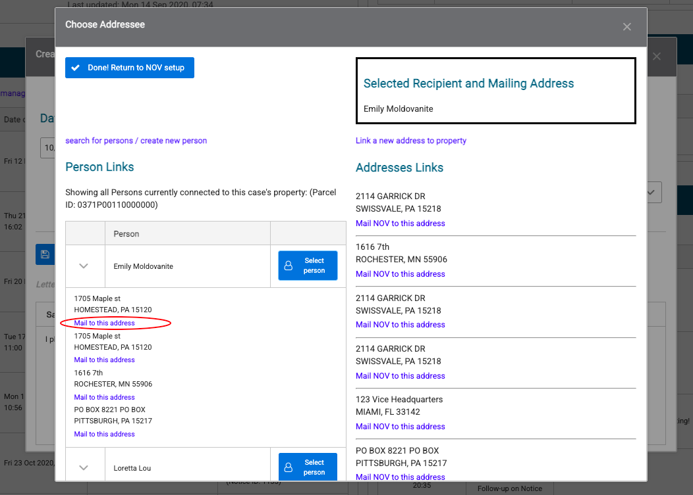

7. Confirm that the correct address and recipient are displayed in the box in the upper right hand corner of the screen. Then, select the button in the upper left hand corner that says 'Done! Return to NOV setup'. 

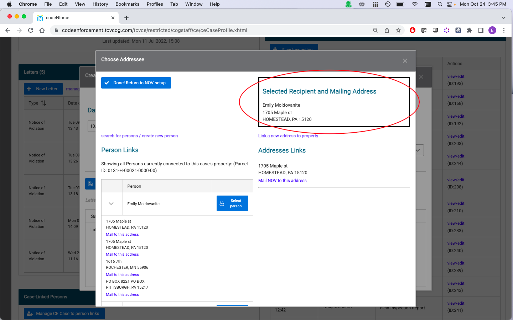

8. Select the notifying officer who is issuing the NOV.

9. Scroll down to review. Prefillled NOV body will display and the code violations will populate. Click remove if any should not be included.

10. Scroll down and select 'Create new notice draft'.

11. The view the NOV, select 'Preview Draft'. This will cause the NOV to open in another browser tab. From here, you can print or save as a PDF.

12. After the NOV has been printed, select 'Finalize and Lock'. After this, the NOV cannot be changed. This is a record of the final mailed copy. 

13. Select 'Record Mailing' (located next to the 'Finalize and Lock' selection). This will also automatically generate a Follow Up Event for the Default follow up window, as configured in the Letter Type settings.

To Remove the NOV, Reset the mailing status, or Mark the notice as returned, select 'Details' under the Actions column.

## Add a new person when creating an NOV

1. Select 'Choose addressee' after you begin a new draft.

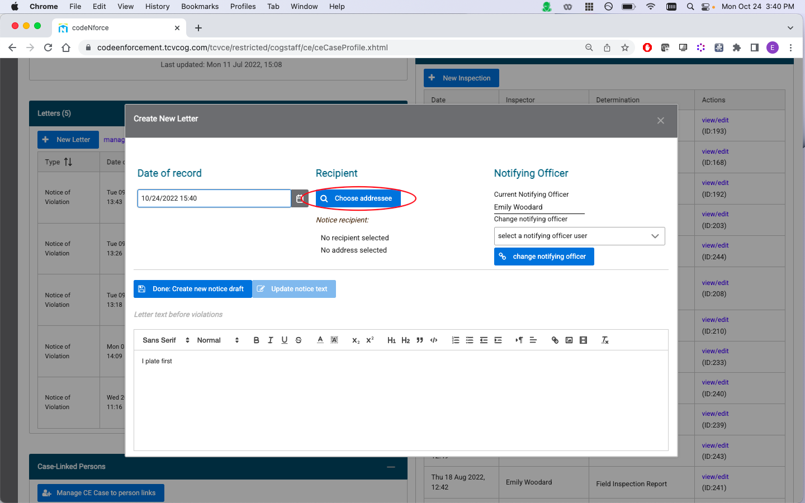

2. Select 'search for persons / create a new person'.

3. Check to see if the person you are looking for is already in CodeNforce by typing their name in the Search for persons box. Then select 'execute selected query'.

4. If the person you are looking for is not shown in the search results, select 'Create new person'. 

5. Enter the information about your person and select 'Save changes' in the upper left hand corner of the pop up box.

6. Under the Quick Links box, select 'Connect person to current property'.

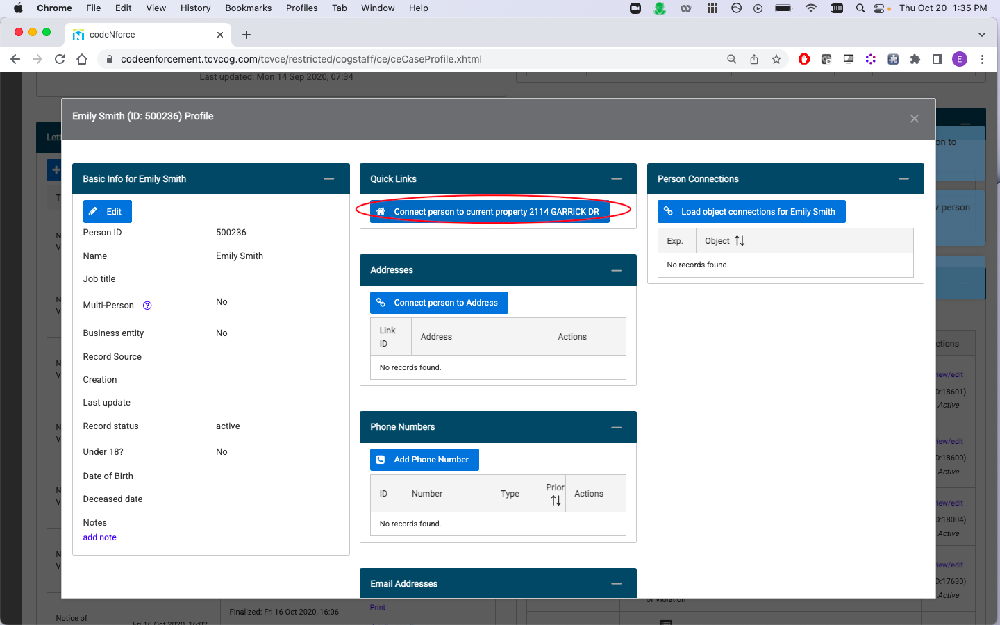

7. Close the pop up box and re-select 'Choose addressee'. The person you selected will now be available to add to the NOV.

## Link a new address when creating an NOV

If the address that you want to mail the NOV to is not currently linked to the case's property, you can add that link from the 'Choose Addressee' screen when you create the NOV. 

1. Select 'Choose Addressee'. Then, select 'Link a new address to property' on the right hand side of the screen. 

2. Enter the zip code where your address is located and click 'Search'.

3. The screen will display all streets within that zip code that have previously been entered in CodeNforce. If you would like to add a street, select the button that says 'New street in'. After you have located the street where your address is located, select 'load addresses'.

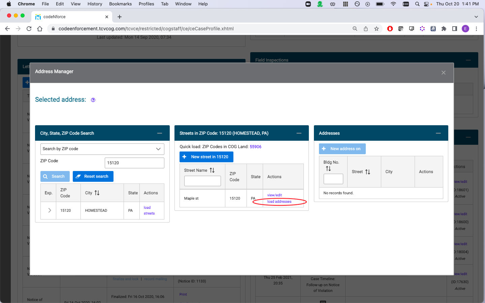

4. Select the building number where your address is located, or add it to the system by selecting 'New address on'. Existing links to parcels and persons will also display in the upper right hand corner. Close the pop up box.

## Manage Letter Types 

Letter Types allow you to set up follow up events for correspondence you send to property owners. To set up a new Letter Type, select "manage Letter Types" from the Letters panel, then select Create new Letter Type. After you complete those steps, the following pop up will display:

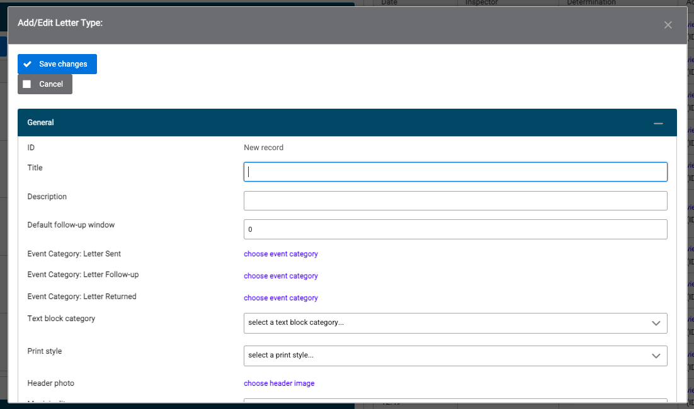

Some of the most important fields to note on this pop up are:

-The Default follow-up window refers to how many days will pass before you are prompted with a follow up event.
-The event categories allow you to choose which events will display after a letter is sent, when follow up is due, and if a letter is returned to sender.
-The Inject Violations checkbox will automatically populate the letter will all violations attached to the case. You will have the ability to remove individual violations after you create the letter.

To update the settings for an existing Letter Type, select 'view' next to that Letter Type for your municipality.

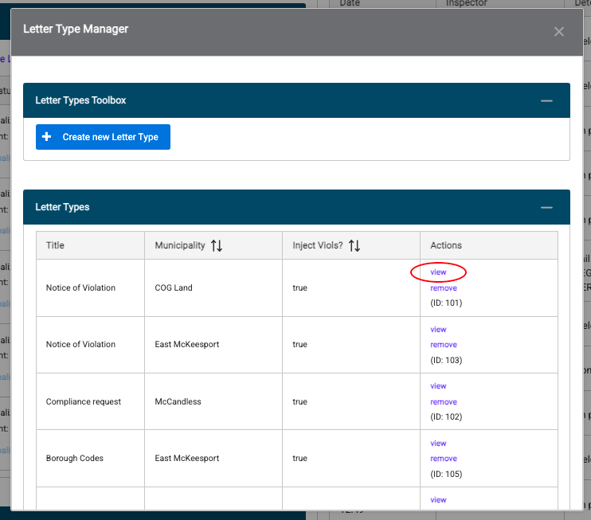

## Log an Event

This space allows you to log any type of introduction, communication, interaction, meeting or other event that happened throughout the timeline of the violation. 

1. To add an event, select the type from the menu shown below:

2. Next, select the event category from the second menu on the right-hand side. 

3. After you’ve selected the type and category of the event, fill in the informational boxes below with as much information as you have. 

4. Once you have all the information filled in, click ‘Create new event’ to attach this event to the case you’ve created. 

5. After the event is saved, it will populate in the original list on the case page. 

## Edit an Event

If a mistake was made in recording the event or you have additional information, find the event in the list and select ‘Modify’.

Once the window pops up, add or edit any information you’d like. 

If you made a mistake in the type or category, please delete the event and create a new one. To delete any event, find the event in the list and select ‘View’.

## Upload Files and Photos

1. Select the 'Add Photo or Document' button.

2. Click the 'Choose' button to select the file you would like to upload.

3. Select the blue 'Upload' button to upload the file to the system.

4. Navigate to your uploaded document at the bottom of the Files and Photos panel, and select 'edit' under the Actions column to add a title and description for your document.

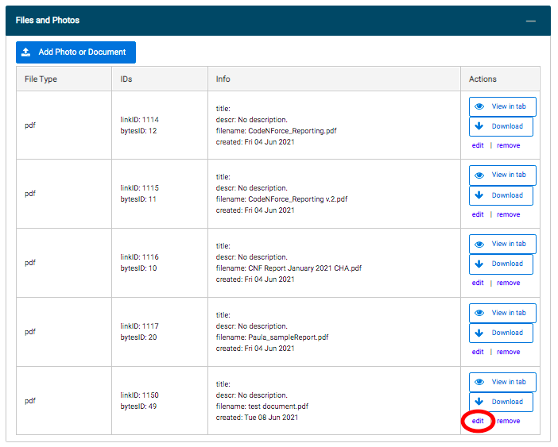

