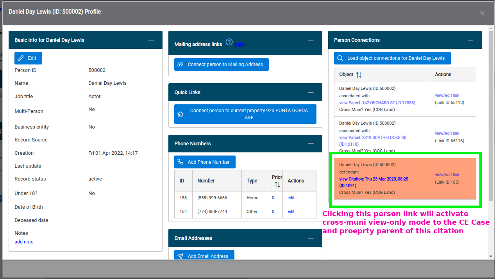
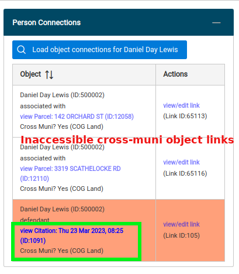
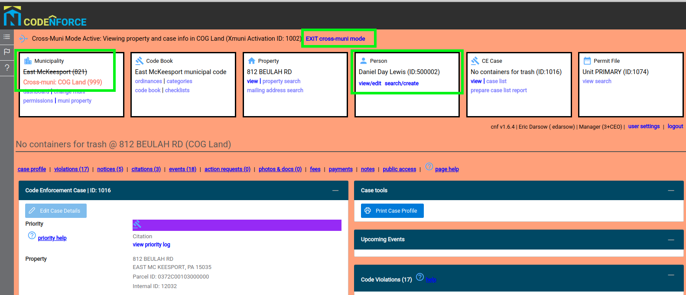
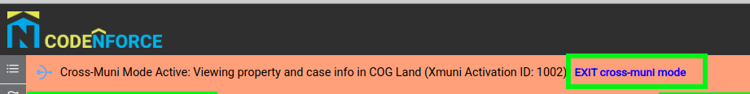

# Cross muni case/citation and property viewing
The XMuni facility is provided to allow internal users of codeNforce to access code enforcement case information along with that case's host property property profile of objects outside their authorized/session municipality. Cross-muni data is only accessible through certain linked person records.

## Finding cross-muni data
Person records are global to all codeNforce municipalities. Searching for and displaying a `Person`'s profile includes viewing the results of a sophisticated cross-table query of all links between a given `Person` and most major business objects in codeNforce including properties, cecases, action requests, citations, citation dockets, events, permit files, and municipalities.

The June 2023 implementation allows only links between `Person` objects and either citations or citation dockets to function as portals into the cross-muni data read-only mode. 

The figure below shows Daniel Day Lewis's person profile dialog as viewed by a user authorized in the East McKeesport Municipality. The right-most column lists any objects to which Daniel has been linked in any municipality codeNForce wide.

## Accessing cross-muni data through a person link
Taking a closer look at this list of three connections between a codeNforce business object between Mr. D. Day Lewis connections : The first two records show links between Mr. D. Day Lewis and COG Land parcels. The `view parcel` links in these two records are disabled because a) the viewing user is not inside a COG Land session and b) the external muni linked objects are not citations or dockets. 

Notice the third record with a salmon background to highlight an activatable cross-muni data record! Mr. D. Day Lewis has been designated a defendant in a citation included in a COGLand code enforcement case and the business logic allows this East McKeesport user to view not only that COG Land citation but also the code enforcement case holding that citation and that case's property! Click the active link to enter cross-muni view mode and view the data!

## Working in cross-muni mode
After clicking an active cross-muni person link codeNforce switches into the special read-only cross-muni designated with the same salmon background filling the background page panels. When in cross-muni mode codeNforce prominently displays a cross-muni control bar above the session objects. The session muni box also changes display mode to show that the user's municipality is not quite East McKeesport anymore--it's more like being in a read-only version of COG Land.

## Leaving cross-muni mode
Leave cross-muni mode by clicking the `EXIT cross-muni mode` link in the special cross-muni control bar above your session boxes. The departing user will be routed to the original municipality's muni property profile page and cross-muni mode lock-outs will be disabled. 

Note: you can also leave cross-muni mode by simply logging out of codeNforce.

## Cross-muni facility use logging
For program evaluation purposes all activations of cross-muni view mode are logged in the database for permanent storage. The viewing user, their conduit person, that person's linked object, along with the xmuni mode activation and exit timestamps are recorded. No user actions inside cross-muni mode are recorded.