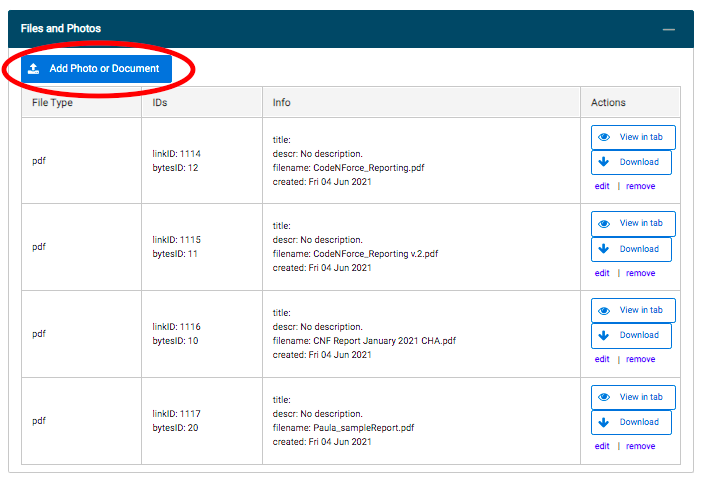
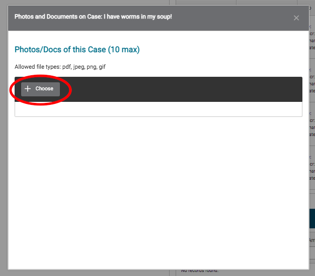
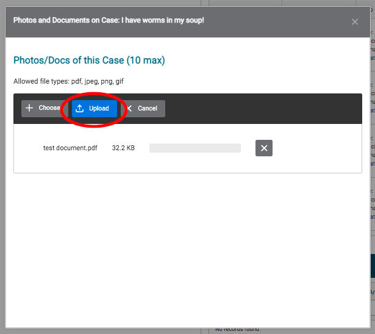

# Uploading Documents and Photos

1. Select the Add Photo or Document button.

2. Click the Choose button to select the file you would like to upload.

3. Select the blue Upload button to upload the file to the system.

4. Navigate to your uploaded document at the bottom of the Files and Photos panel, and select "edit" under the Actions column to add a title and description for your document.

