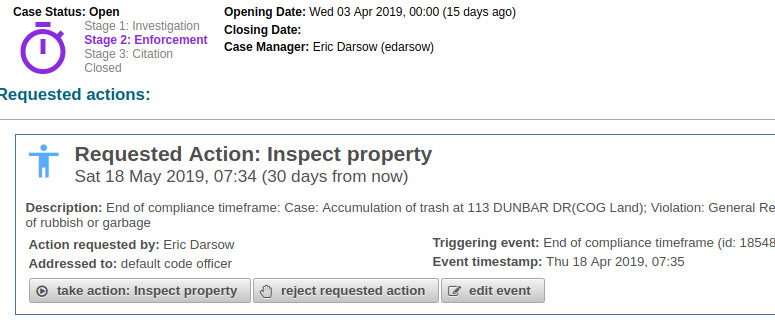

# Subsystem briefing: Code enforcement phase management and requested events

This overview page describes how COGConnect represents and processes Code Enforcement case events and their associated phase changes. The representative screen shot of the UI for these services is found in ceCases.xhtml and looks like this (extra UI elements clipped):

## CasePhase and case stages
Code enforcement cases possess a `CasePhase` object which is a custom type in postgres and an Enum in Java. In the early days of COGConnect these phases were vetted and checked with code officers. Jesse even said "That's exactly what we do." The challenge is, however, that a seven-phase work flow is not easily tracked in one's head. We needed a more succinct way to express where a given code enforcement case  may be in its life cycle.

`CitationStatus` objects also contain a `CasePhaseChangeRule` object which is processed whenever a `Citation` changes status. This, processing may lead to a change in `CasePhase` but also the creation of additional `Event` objects.

### The CasePhase progression
The Phases are as follows (in order of actual case management workflow)

11. PrelimInvestigationPending("Preliminary Investigation Pending"),
11. NoticeDelivery("Notice of Violation Delivery"),
11. InitialComplianceTimeframe("Initial Compliance Timeframe"),
11. SecondaryComplianceTimeframe("Secondary Compliance Timeframe"),
11. AwaitingHearingDate("Awaiting Hearing"),
11. HearingPreparation("Hearing Preparation"),
11. InitialPostHearingComplianceTimeframe("Initial Post-Hearing Compliance Timeframe"),
11. SecondaryPostHearingComplianceTimeframe("Secondary Post-Hearing Compliance Timeframe"),
11. InactiveHolding("Inactive Holding"),
11. Closed("Closed"),
11. LegacyImported("Legacy data container case");

### Case stages
A case stage (not a Java object) is a value derived from the case's phase, and reduces the seven phases to three active stages and the closed stage:

11. Investigation (A notice of violation has not yet been mailed)
11. Enforcement (Notice has been mailed, and no violations have been cited)
11. Citation (At least one code violation on the case has been attached to a citation)

## Bundling of logic in CasePhaseChangeRule objects
Ushering a code enforcement case through these phases is driven by a set of rules which are encapsulated in an object called the `CasePhaseChangeRule`. These objects live on `EventCategory` objects and, when present on a given `Event`, are used by the `CaseCoordinator` during event processing to make two distinct but related determinations:

* Should this case's phase be changed? If so, to what?
* Do I need to create an Event that requests an action from a user? If so, what `EventCategory` should be requested?

Information for making both of these determinations is bundled in the single `CasePhaseChangeRule` object because many requested event categories themselves trigger case phase changes, so designing the relationships together and writing them to a single object simplifies what is already a somewhat convoluted determination process.

## Chained triggers
If a CasePhase rule passes, that rule's specified triggered `EventCategory` is created and added to the case. Since this  `EventCategory` could also have its own rule, and triggered `EventCategory`, a set cascade of case changes may occur with the processing of a single event. 

For example, if a `Citation` has its status changed to 'case dismissed', that `CitationStatus` object will contain a `CasePhaseChangeRule` object which specifies that the code enforcement case's `CasePhase` should become `CasePhase.Closed` and that a logically categorized `Event` should be attached to the case depicting this particular series of events--to be forever encapsulated in the case's history.
