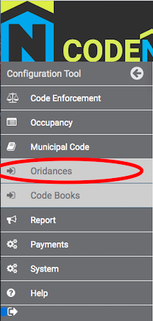

# Adding a New Ordinance to CodeNforce

There are two steps to entering a new ordinance in CodeNforce. 

First, enter your ordinance on the Ordinances page.

Next, add your ordinance to your municipality's Code Book on the Code Books page.

Detailed instructions for how to complete both steps are available on each designated page.

Once your ordinance is added to the Code Book, please log out of CodeNforce to save all changes. The new changes will not display until you log back in.
