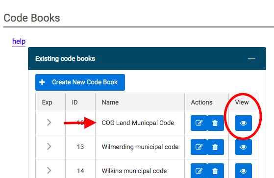
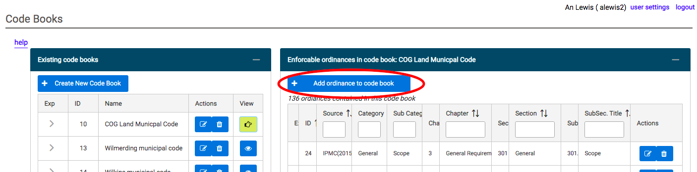
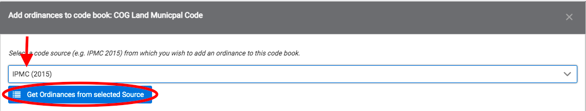
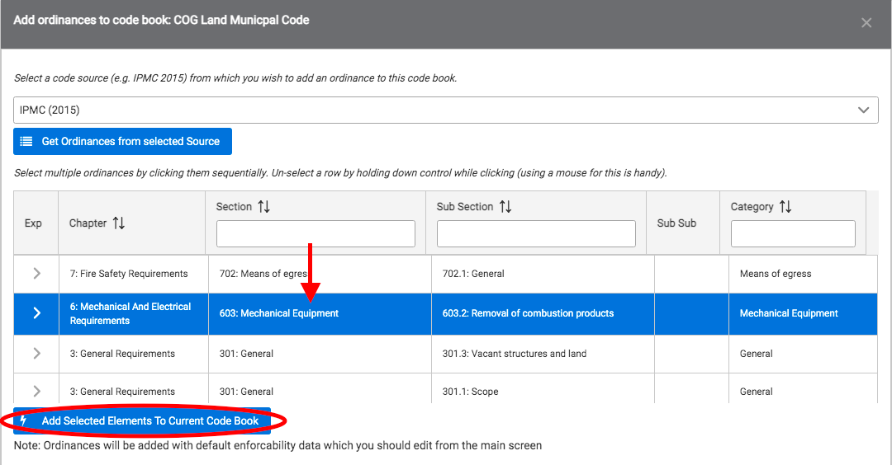

# Adding an Ordinance to a Code Book

Note: This is the second step of the process for adding a new ordinance to the CodeNforce system. If you have not yet entered the details of your ordinance on the Ordinances page, please do that first.

1. Under the "Existing Code Books" panel, select the code book for your municipality by clicking on the corresponding View icon.

2. Under the "Enforcable Ordinances in Code Book" panel, select "Add Ordinance to Code Book".

3. Select the Code Source that you previously entered your new ordinance under and click "Get Ordinances from Selected Source".

4. Use the arrows and search boxes at the top of the chart to locate the ordinate you would like to add. Select that ordinance, causing its row to turn blue. Click "Add Selected Elements to Current Code Book".

5. Please log out of the CodeNforce system to activate these changes.

