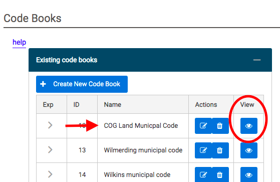
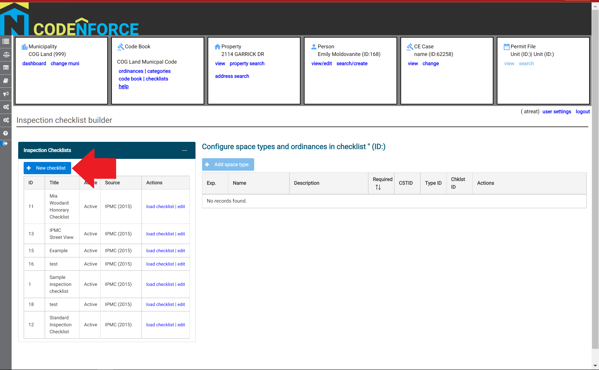
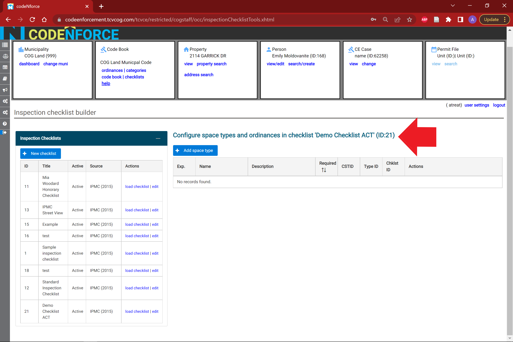
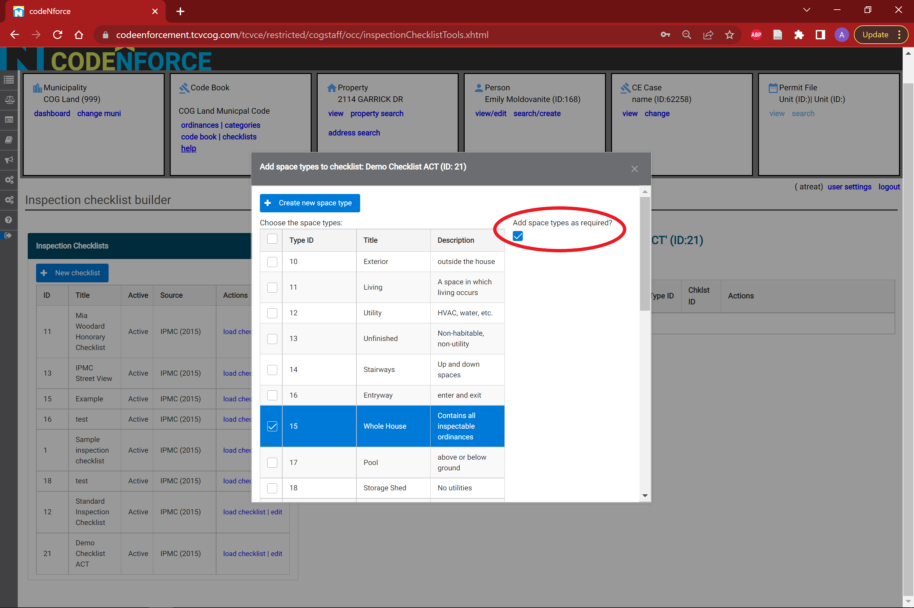
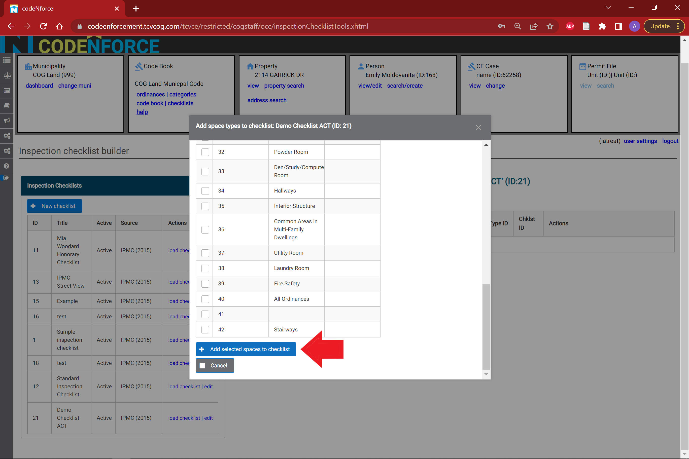

# Adding a New Ordinance to CodeNforce

There are two steps to entering a new ordinance in CodeNforce:

- [Step 1: Enter your ordinance on the Ordinances page.](#Enter-your-Ordinance-into-CodeNforce)

- [Step 2: Add your ordinance to your municipality's Code Book on the Code Book's page.](#Add-an-Ordinance-to-a-Code-Book) 

**Once your ordinance is added to the Code Book, please log out of CodeNforce to save all changes. The new changes will not display until you log back in.**

## Enter an Ordinance into CodeNforce

(1) Under the Code Source panel, select your Code Source by clicking the corresponding View icon. 

(2) Under the Ordinance List panel, select "Add new ordinance to source".

(3) Enter the information for your ordinance, and then select "Commit new ordinance".

(4) Once your ordinance has been entered, please proceed to the Code Books page to add the ordinance to your municipality's Code Book.

## Add an Ordinance to a Code Book

*Note: This is the second step in the process for adding a new ordinance to the CodeNforce system. If you have not yet entered the details of your ordinance in the Ordinances page, please do that first.*

(1) Under the "Existing Code Books" panel, select the code book for your municipality by clicking on the corresponding View icon.

(2) Under the "Enforcable Ordinances in Code Book" panel, select "Add Ordinance to Code Book".

(3) Select the Code Source that you previously entered your new ordinance under and click "Get Ordinances from Selected Source".

(4) Use the arrows and search boxes at the top of the chart to locate the ordinate you would like to add. Select that ordinance, causing its row to turn blue. Click "Add Selected Elements to Current Code Book".

(5) Please log out of the CodeNforce system to activate these changes.

# Create A Checklist 

(1) Select the 'checklist' link in the 'Code Book' section of the dashboard. 

(2) Select the '+ New checklist' button on the inspection checlist builder page. 

A pop-up window will appear in the middle of the page. 

(3) Fill in the municipality, title, description, and governing code for the new checklist that you want to create. Then, select "Save Changes". 

***The default municipality in this pop-up window may not be the municipality you are currently logged into! Choose the desired municipality from the drop-down menu. The checklist you create will only appear for the municipality chosen in this field!***

(4) After saving the basic information for your new checklist in step 3, the "Save Changes" button will dissapear, but the pop-up window will remain. At this point you can either edit the basic information (red arrow), or exit the window (red circle). 

(5) The new checklist you created should appear at the bottom of the inspection checklist builder for the municipality you chose in step 3. If not, refresh the webpage.

Select the 'load checklist' link to continue building the checklist. 

After clicking the 'load checklist' link, the title of the new checklist should appear on the right hand side. Now you are ready to add items to your list! 

(6) Select the '+ Add Space Type' button. 

This will generate a pop-up window that prompts you to choose one or more spaces to add to your checklist. You can also choose to make the spaces that you are adding to the checklist required (red circle). Note, that the 'required' flag will be added to ALL of the spaces you chose in this window.  However, you can change a required space into an optional space later (see step 8).

When you are done, scroll down to the bottom of the list of spaces and click the 'Add selected spaces to checklist' button. 

(7)  You should now be able to see all of the spaces you selected and link the associated ordinances that apply to each space. Select the 'link ordances' link in the 'Actions' section of the space.

A pop-up window listing all the related code elements from the governing code you selected in step 3.  To read a description of the code element, click the arrow symbol on the left-hand side of the code element (red circle). 

Select the code element(s) you want to link to the space by clicking the empty box next to the 'ID' of that code element. You can also select all of the code elements in the list by clicking the box in the header of the windw (red circle). You can also mark a code element as required by checking the box in the 'Required' column on the right-hand side. 

When you are done selecting code elements, select the 'Connect selected ordinances to space type: ' button (red arrow).

(8) Double checking and editing your new list. 

You can confirm which code element(s) were linked to each space in your checklist by selecting the arrow on the left-hand side of the inspection space (red circle). You can also 'remove' a space or mark a required space as 'optional' using the links on the right-hand side of the space (red box). 

