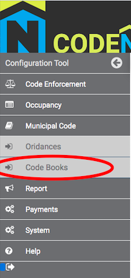

# Entering a New Ordinance
1. Under the Code Source panel, select the Code Source that your ordinance will fall under by clicking the corresponding View icon. 
2. Under the Ordinance List panel, select "Add new ordinance to source".
3. Enter the information for your ordinance, and then select "Commit new ordinance".
4. Once your ordinance has been entered, please proceed to the Code Books page to add the ordinance to your municipality's Code Book.
