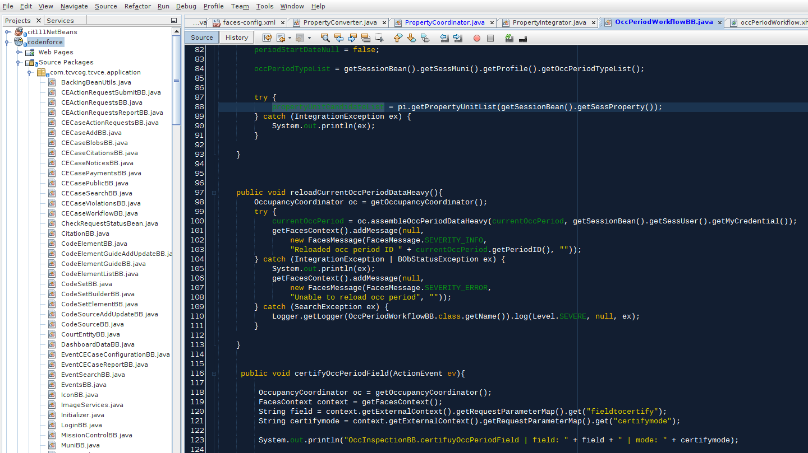

# Coding norms
A hodgepodge of notes made during development that probably should be sorted into domain-specific pages but live here for review by developers.

#### BOb Coordinators and the Search Coordinator
Coordinators should be asked for default Query objects, and that coordinator then sends the appropriate Enum of the QueryType to the initQuery variant in the SearchCoordinator who creates a Query object and populates it with appropriate SearchParam objects

#### Searching permissions
searchForXXX methods on Integrators should not require any user-level info for authentication purposes. User-specific search settings should be configured as needed down in the SearchParams objects. The runQuery method family requires a credential and a query, and will be responsible for checking permissions and logging all query runs

#### auditXXX methods
auditXXX methods are responsible for checking the state of objects after configuration or before key events, like insertions. Their return types should all be void and instead communicate problems by throwing a logically typed Exception subclass containing a useful error message that will eventually get passed all the way back to the user.

### fidelity to scope hierarchy

#### avoid calling integrators in backign beans scoped to `view` or narrower


#### Coordinator versus Integrator method names
To differentiate between direct database operations that represent the base level function and Coordinator logic controls, the following norms of naming can help make roles clear
Coordinators createFoo &gt; Integrators updateFoo
Coordinators editFoo &gt; Integrators updateFoo
Coordinators deleteFoo &gt; Integrators inactivateFoo
Coordinators nukeFoo &gt; Integrators deleteFoo

# Linked objects

## Linking table standard
A unified linking structure exists to allow reuse of methods for reading, writing, and deactivating linking records. The `citationhuman` table represents fidelity to this standard:

```

CREATE TABLE public.citationhuman
(
  linkid integer NOT NULL DEFAULT nextval('citationhuman_seq'::regclass),
  human_humanid integer,
  citation_citationid integer,
  linkedobjectrole_lorid integer,
  source_sourceid integer,
  createdts timestamp with time zone,
  createdby_userid integer,
  lastupdatedts timestamp with time zone,
  lastupdatedby_userid integer,
  deactivatedts timestamp with time zone,
  deactivatedby_userid integer,
  notes text,
  CONSTRAINT humancitation_pkey PRIMARY KEY (linkid),
  CONSTRAINT citationhuman_lorid_fk FOREIGN KEY (linkedobjectrole_lorid)
      REFERENCES public.linkedobjectrole (lorid) MATCH SIMPLE,
  CONSTRAINT humancitation_citationid_fk FOREIGN KEY (citation_citationid)
      REFERENCES public.citation (citationid) MATCH SIMPLE,
  CONSTRAINT humancitation_createdby_userid_fk FOREIGN KEY (createdby_userid)
      REFERENCES public.login (userid) MATCH SIMPLE,
  CONSTRAINT humancitation_deactivatedby_userid_fk FOREIGN KEY (deactivatedby_userid)
      REFERENCES public.login (userid) MATCH SIMPLE,
  CONSTRAINT humancitation_humanid_fk FOREIGN KEY (human_humanid)
      REFERENCES public.human (humanid) MATCH SIMPLE,
  CONSTRAINT humancitation_lastupdatdby_userid_fk FOREIGN KEY (lastupdatedby_userid)
      REFERENCES public.login (userid) MATCH SIMPLE,
  CONSTRAINT humancitation_sourceid_fk FOREIGN KEY (source_sourceid)
      REFERENCES public.bobsource (sourceid) MATCH SIMPLE
);
```

### Standard linking table features
* a single field primary key, such that the link has its own ID separate of the two FK fields that create the link itself. This allows multiple linked roles between the same two objects. For example a human might be both the applicant for a permit and a property manager on the same `parcelunit`
* a foreign key to the table linkedobjectrole which contains schemas defined for each object link for naming the nature of the connection
* standardized tracked entity fields for recording when and who created, updated, and deactivated the record
* a foreign key to the `bobsource` table
* a notes field

