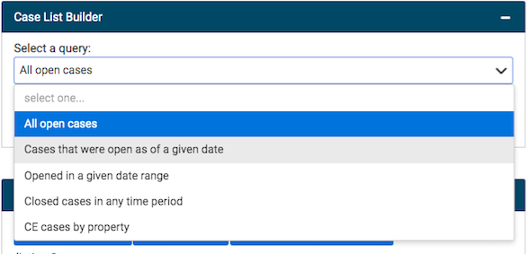

## Case List Builder

Case List Builder allows you to run a search for code enforcement cases that meet different criteria. To run your search, select the search criteria you would like to display from the dropdown menu:

Then, click Run Search.

The search results will display on the Code Enforcement Case List panel located directly below the Case List Builder.

To run a second search, first click Clear Results to reset the results list.

