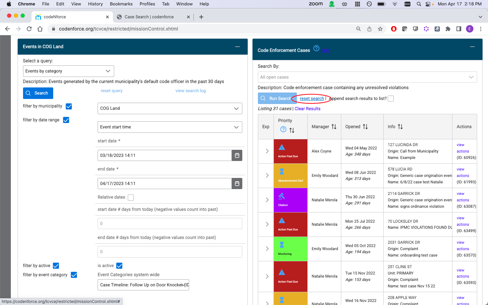

## Case Search

Case Search allows you to run a search for code enforcement cases that meet different criteria. To run your search, select the search criteria you would like to display from the dropdown menu:

Then, click Run Search.

The search results will display on the Code Enforcement Case List panel located directly below the Case List Builder.

To run a second search, first click 'reset search'.

## Case Priority Color Scheme

Each case is assigned a color based on the compliance deadline attached to the case's violations. The earliest compliance deadline in the case is used to determine the color.

## Custom Event Search

(1) Scroll down to 'Select a query' in the 'Events' box.

(2) Select 'Events by category' in the dropdown menu.

(3) Select the date range that you would like to use for your search.

(4) Select the event category that you would like to track in your search

(5) Scroll up and press 'Search'.

To run a second search, first select 'reset query'

