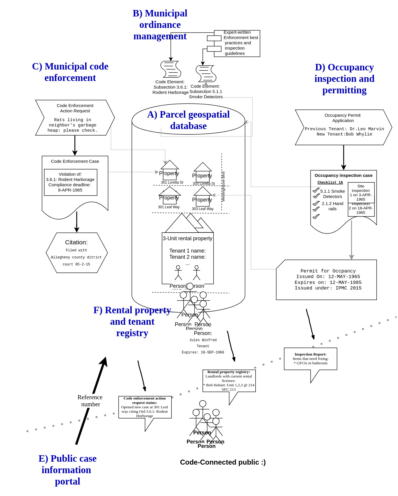

# CodeNForce system documentation
CodeNForce is a JavaEE-based, open source web database application for managing municpal government code enforcement and occupancy permitting workflows. Built by Technology Rediscovery LLC and students attending the Community College of Allgheny County, CodeNForce's geographic center is the Turtle Creek Valley on the outskirts of Pittsburgh, PA.

## About this documentation
As technical documentation designed for developers, the primary audience for these pages are system administrators and developers who wish to build, edit, or maintain an existing CodeConnect instance. Sub-components of the system each have their own briefing page which links to specific files in the repo as they are explained and indexes how-to pages for various tasks. 

## Subsystem briefing pages

### N [User](ss_User.md)
### I [Municipality](ss_Municipality.md)
### II [Codebook](ss_Codebook.md)
### III [Property](ss_Property.md)
### IV [Person](ss_Person.md)
### V [Event](ss_Event.md)
### VI [Occperiod](ss_Occperiod.md)
### VII [Cecase](ss_Cecase.md)
### VIII [Ceactionrequest](ss_Ceactionrequest.md)
### VIV [Occapp](ss_Occapp.md)
### X [Payment](ss_Payment.md)
### XI [Report](ss_Report.md)
### XII [Blob](ss_Blob.md)
### XIII [Publicinfobundle](ss_Publicinfobundle.md)
### XIV [Search](ss_Search.md)
### XV [Workflow](ss_Choice.md)
### XVI [Analytics](ss_analytics.md)
### VII [Data integrity](ss_dataintegrity.md)

## Legacy doc pages

[Code enforcement phase management and requested events](cecasephases.md)

[Notice of violation letters](novs.md)

[Coding norms](codingNorms.md)

[Essential documentation links and topic references](references.md)

[Adding utility table and new columns to a postgres table](pg-add-table-columns.md)

[Creating user-modifyable database queries(i.e. serching)](searching.md)

[Managing user-muni connections mini-project](muni-user-project.md)

[Property unit management mini-project](property-unit-mini-project.md)

