# Field inspections
Updated on 20-JUL-2023 after dashboard inspections going live.

Field inspections record the outcome of a code officer's on-the-ground assessment of a property's compliance with checklist items grouped by the space type being inspected. 

Features include:
* Municipality-specific custom checklists to match the reason and scope of inspections, such as an exterior-only checklist, a sign inspection checklist, or a swimming pool checklist
* Batch photo upload and linking of photos to individual checklist items
* Printable inspection reports with embedded photos and findings
* Easy transfer of violated checklist items into code enforcement cases to monitor compliance 
* One-click re-inspections make for slick documentation of a property's progress toward compliance

## Inspection process
1. [Locate the permit file or code enforcement case](#home) to which the inspection should be attached
1. [Start a new inspection or a re-inspection](#start) on that permit file or case
	* If creating a new inspection, choose an inspection checklist
1. [Configure inspection details](#configure): inspector, start/end times, comments
1. [Choose a space type](#spacetype) to inspect 
1. [Conduct the inspection](#conduct), adding additional spaces and taking photos as you go
1. [Upload all the inspection photos](#upload) to the inspection photo pool
1. [Attach photos](#attach) to individual checklist items
1. [Finalize](#finalize) the inspection
1. [Generate an inspection report](#report)
1. [Transfer violated items](#transfer) to a code enforcement case (optional)

### Find the right place for the inspection {#home}
1. Search for and view the relevant property for your inspection. 
2. From the property profile page locate the appropriate permit file or code enforcement case to which the inspection should be attached. Navigate to the permit file or case profile page. 
	* NOTE: Only open code enforcement cases can receive a new inspection. 
    * Alternatively, if you know a permit file or case exists on the property of interest, simply find the relevant record on the dashboard lists and proceed to the next step
 
## Start a new inspection or setup a re-inspection {#start}
If starting an inspection from the dashboard on either a code enforcement case or permit file, click the link in the Actions column called **inspect**. An inspection selection dialog appears. Start a fresh inspection using the button on the left or choose to reinspect a previous inspection using the tools on the right side of the dialog.

If you start a new inspection, you'll first be prompted to choose an inspection checklist. You can customize or build a new checklist using codeNforce's checklist builder accessed in the top navigation bar's **Code Book** box using the link **checklists**.

### One-click reinspections
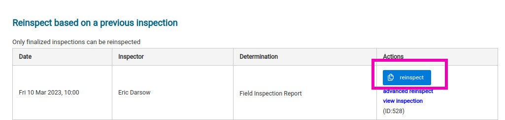

The blue **reinspect** button will automatically build you a new inspection based on the inspection you've chosen to reinspect using sensible default settings such as only reinspecting spaces with failed items. If you'd prefer to have complete control over all the reinspection settings, use the link called **advanced reinspect** which will produce the reinspection settings dialog and ask for confirmation prior to building a new inspection. 

### Identifying reinspections
As soon as you use the one-click reinspect button or confirm reinspection advanced settings, the familiar inspection info dialog appears. You'll know that your current inspection is a reinspection because the pre-inpsection notes are pre-populated with reinspection info and the inspection type will be listed as *Re-Inspection to inspection ID:???*

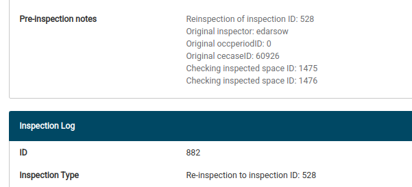

## Configure inspection {#configure}
The "home screen" of any field inspection is the inspection profile dialog and contains tools for configuring, conducting, finalizing, and documenting your inspection. 

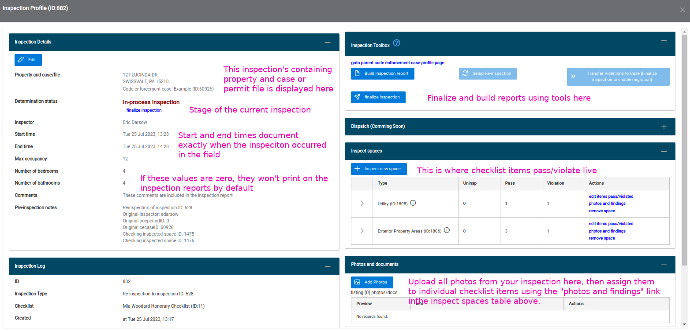

The inspection details panel allows users to specify the inspector, start/end times, maximum occupancy limits, and compose overall comments and pre-inspection comments.

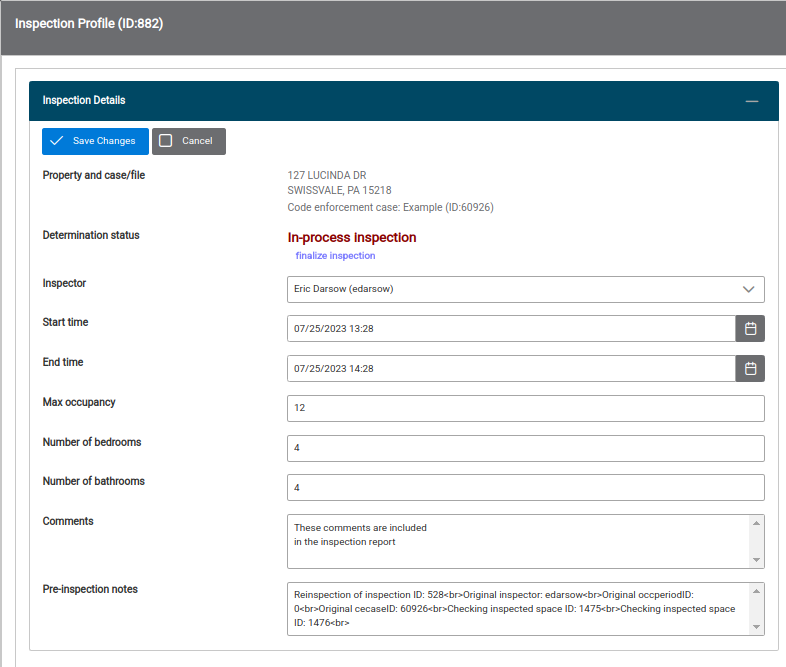

## Choosing a space type {#spacetype}
Once your inspection details are in good shape, users actually conduct pass/violate determinations by choosing a space type to inspect. Start this process with the all-important **Inspect new space** button located at the top of the Inspect space panel.

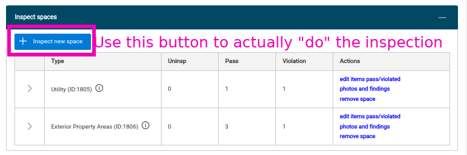

Clicking this button will display a space type choice dialog box where the space type names are displayed and the row expansion details which ordinances are included in each space type's checklist.

You can see below that this particular checklist specifies the inspection of four ordinances when inspecting a space called **Exterior property areas**. 

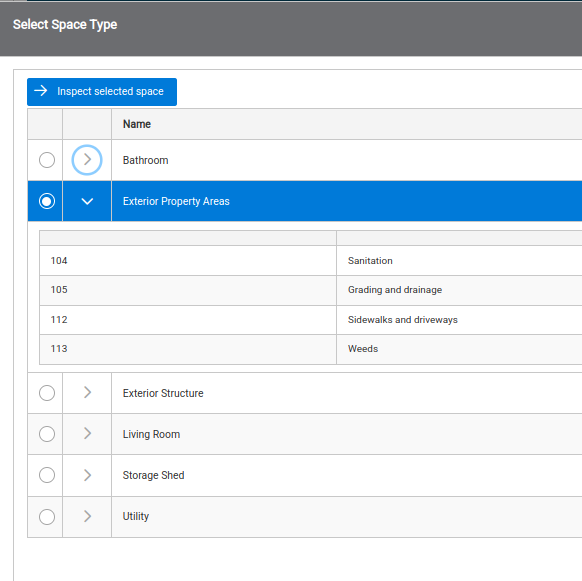

### Whole house space type
You cannot add or remove checklist items from this dialog. Many towns have decided to include a space type called something like "Whole house" or "all ordinances" in each checklist which contains all ordinances in the town's codebook. This allows inspectors to always access uncommonly enforced ordinances during an inspection if their space-specific checklist space types do not include a required ordinance. 

Also note that the checklist backing each inspection is determined at the very beginning of the inspection process and cannot be changed by browser users. If you chose an incorrect checklist, deactivate your inspection using the **Transfer and deactivation** panel in the lower left column of the inspection profile. Then make a fresh new inspection with the desired checklist. 

## Inspect the space checklist {#conduct}
After choosing a space type to inspect, the all-important **Inspect ordinances** dialog appears in which users  input checklist item outcomes (pass/violate) and include textual descriptions of inspection findings. Click the blue **Save and continue to photos** button in the upper left corner to proceed.

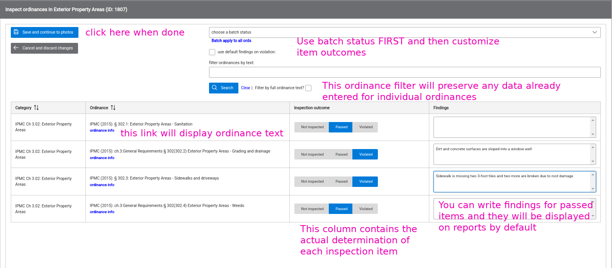

### Batch update and filtering
Use the batch ordinance status applicator at the start of your space inspection. Once the screen refreshes, then customize individual ordinances with an outcome and findings. 

Users can also find their desired checklist item using the full-text filter tool. Enter the text you wish to use in your filter into the text box, then click **Search**. Only matching ordinances appear in your inspection list. Remove the filter with the **Clear** link. Any changes made to individual ordinances are preserved before, during, and after a filter operation. 

### Space summary: Review outcomes and findings dialog
Following the space entry dialog, a review and photo upload dialog appears. This dialog groups all your inspection items based on their outcome: violated items appearing first, followed by passed items, and uninspected items at the bottom. 

Each item's findings and even inspection outcome can be edited individually on this screen. Changes made to any individual item will be saved and this dialog's lists repopulated based on user edits. Users cannot add findings or photos to uninspected items since doing so would mean those items were, in fact, inspected.

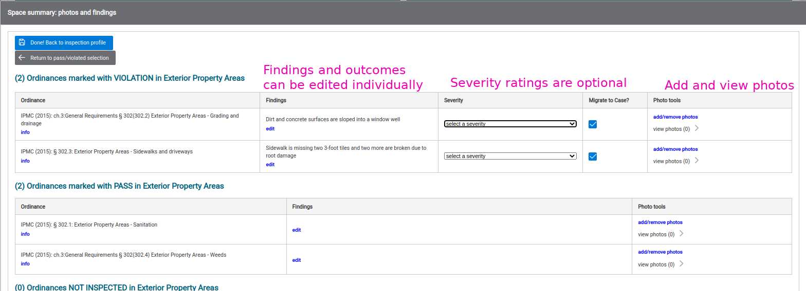

### Final column for photo tools
The final column of the space summary tables provides photo selection and review links. See the next section for details.

## Upload your inspection photos in a batch {#upload}
When you're ready to assign photos to individual inspection items, first upload them as a batch to the overall inspection using the Photos and documents panel in the lower right column of the inspection profile. 

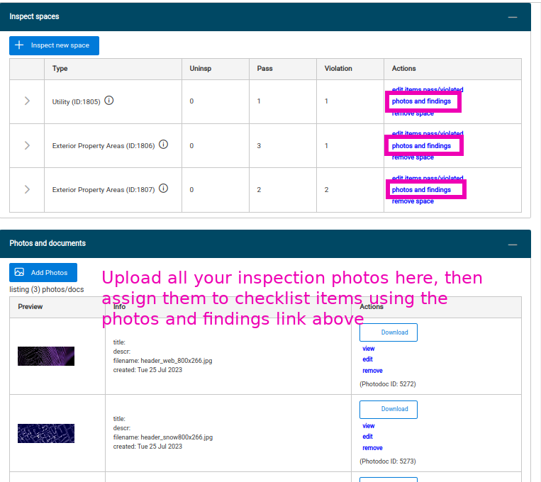

## Attach photos from pool to checklist items {#attach}
Then return to each individual space's **photos and findings** dialog and assign photos from the pool to individual checklist items. You can assign the same photo to several inspection items. Removing the assignment is as easy as a lick on the *remove*link.

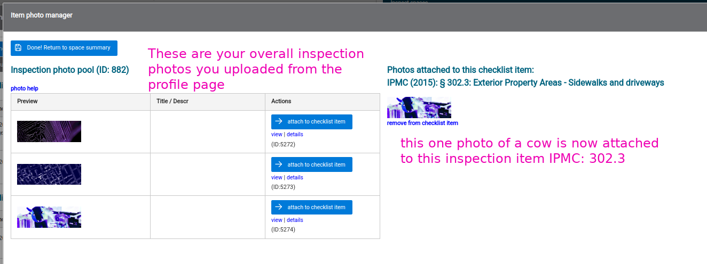

## Review and finalize {#finalize}
After uploading photos, check your ordinance determinations using the row expansion arrows in the leftmost column of the Inspect spaces tables. Adjust any item details using the **photos and findings** link in the *Actions* column

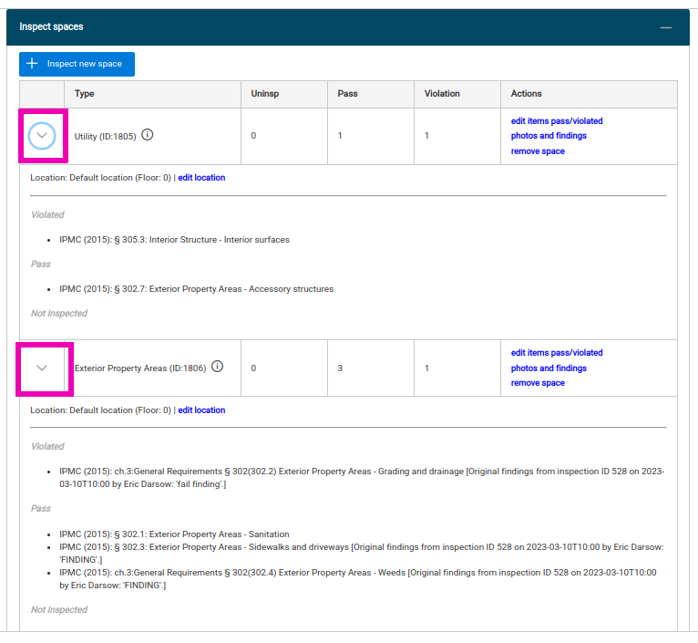

When all your items are in ship shape, finalize the inspection using the blue **Finalize inspection** command button in the inspection toolbox in the upper right panel of the profile. Choose a determination that fits your use case and confirm. You're now unable to add additional spaces to the inspection. You can remove an inspection's finalization by clicking the same button that has now become **Edit determination**. You must first remove finalization and then re-finalize with your adjusted outcome.

## Generate an inspection report {#report}
The final step is to generate a printable inspection report using the blue toolbox button called **Build inspection report**. The report builder's dialog allows for full-control over which data is included in the final report. 
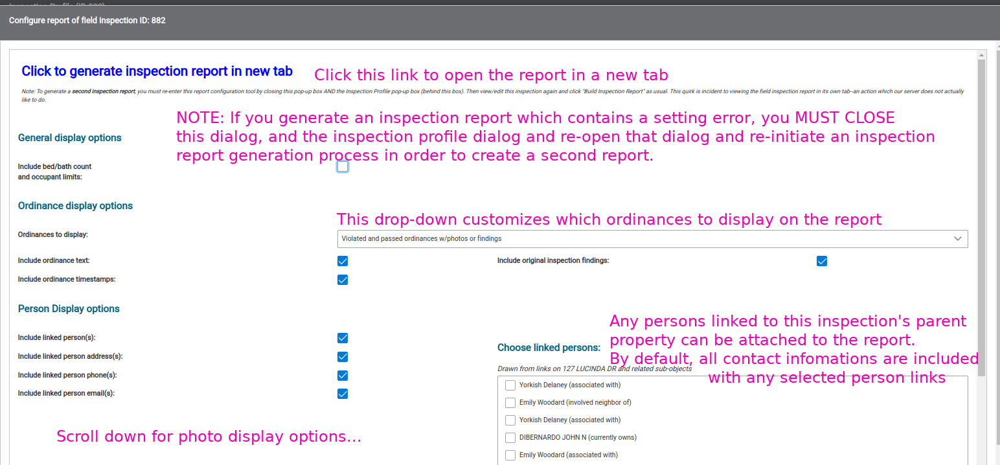

## Transfer violated items to a code enforcement case {#transfer}

(1) After an inspection has been finalized, you can transfer the violations that were found to your case so that you do not need to re-enter them. To do this, select 'Transfer Violated Elements' in the Inspection Toolbox.

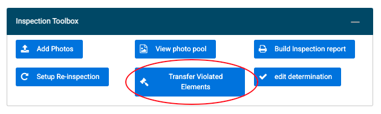

(2) Select that you would like to add violations to an existing case.

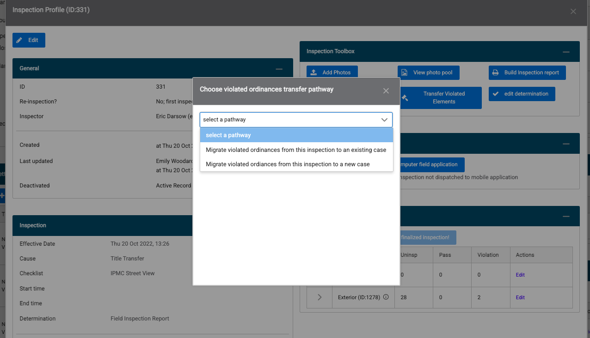

(3) Review the violations and enter case details to complete the transfer.

