# Field inspections
Updated on 20-JUL-2023 after dashboard inspections going live.

Field inspections record the outcome of a code officer's on-the-ground assessment of a property's compliance with checklist items grouped by the space type being inspected. 

Features include:
* Municipality-specific custom checklists to match the reason and scope of inspections, such as an exterior-only checklist, a sign inspection checklist, or a swimming pool checklist
* Batch photo upload and linking of photos to individual checklist items
* Printable inspection reports with embedded photos and findings
* Easy transfer of violated checklist items into code enforcement cases to monitor compliance 
* One-click re-inspections make for slick documentation of a property's progress toward compliance

## Inspection process
1. [Locate the permit file or code enforcement case](#home) to which the inspection should be attached
1. [Start a new inspection or a re-inspection](#start) on that permit file or case
	* If creating a new inspection, choose an inspection checklist
1. [Configure inspection details](#configure): inspector, start/end times, comments
1. [Choose a space type](#spacetype) to inspect 
1. [Conduct the inspection](#conduct), adding additional spaces and taking photos as you go
1. [Upload all the inspection photos](#upload) to the inspection photo pool
1. [Attach photos](#attach) to individual checklist items
1. [Finalize](#finalize) the inspection
1. [Generate an inspection report](#report)
1. [Transfer violated items](#transfer) to a code enforcement case (optional)

### Find the right place for the inspection {#home}
1. Search for and view the relevant property for your inspection. From the property profile page locate the appropriate permit file or code enforcement case to which the inspection should be attached. Navigate to the permit file or case profile page. NOTE: Only open code enforcement cases can receive a new inspection. 
    * Alternatively, if you know a permit file or case exists on the property of interest, simply find the relevant record on the dashboard search tools.
 
## Start a new inspection or build a re-inspection {#start}

## Conduct a Field Inspection {#conduct}
Inspections (and re-inspections) can be initiated on both permit files and code enforcement cases directly from the dashboard or the permit file or case profile pages.

## Configure inspection details {#configure}

## Choosing a space type {#spacetype}

## Upload your inspection photos in a batch {#upload}

## Attach photos from pool to checklist items {#attach}

## Review and finalize {#finalize}

## Generate an inspection report {#report}

## Transfer violated items to a code enforcement case {#transfer}

### Starting an inspection from the dashboard

### Starting an inspection from the permit file or case profile pages

(1) From the code enforcement case page, select the '+ New inspection' button under the 'Field Inspection' banner. 

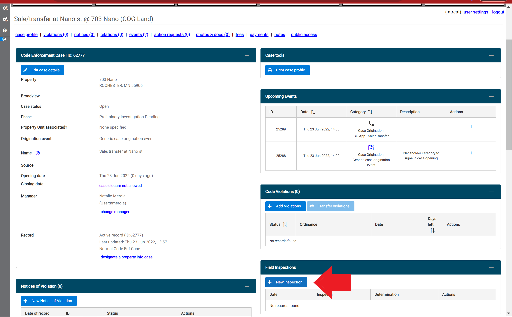

(2) Choose the inspection checklist that you want to use and select the 'Create' button.

(3) Enter the inspector, date, and time of the inspection, and any notes, in the 'Inspection Profile' pop-up window.  Select the 'Save Changes' button.  

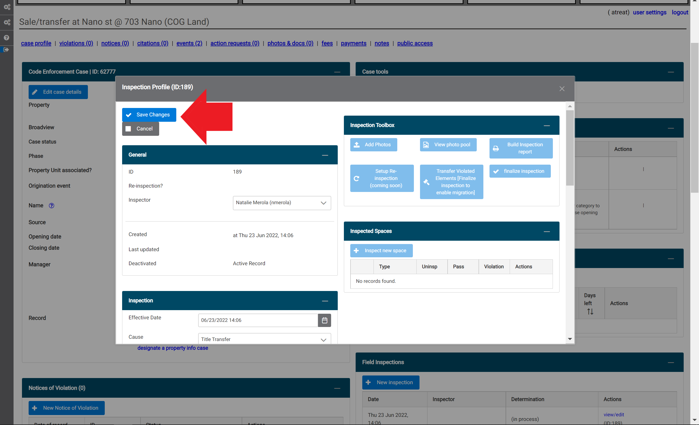

(4) Select the 'Inspect new space' button.  

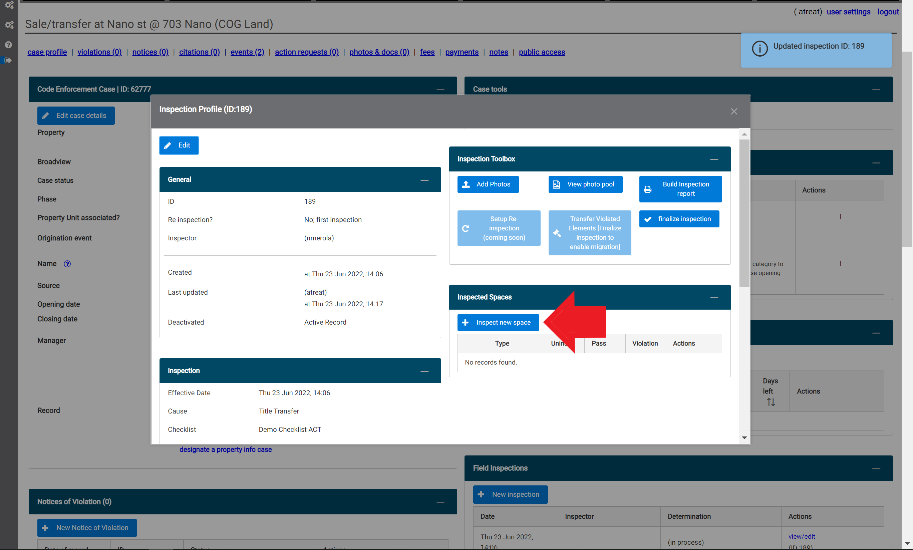

(5) Select the space(s) and click 'Continue'.

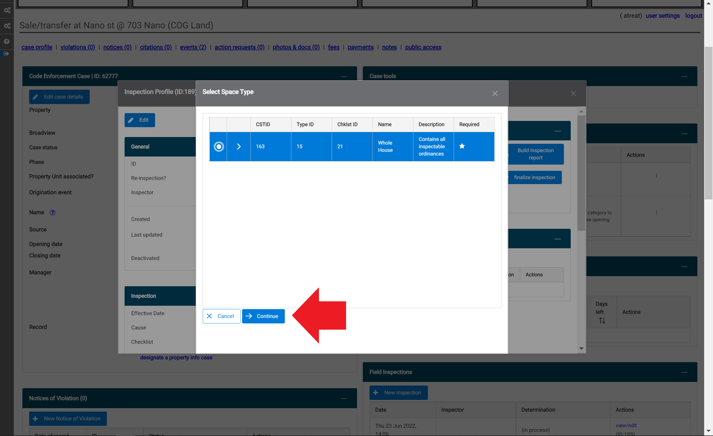

(6) You can choose to add a location descriptor. To start the inspection, select the 'Inspect spance now!' button.

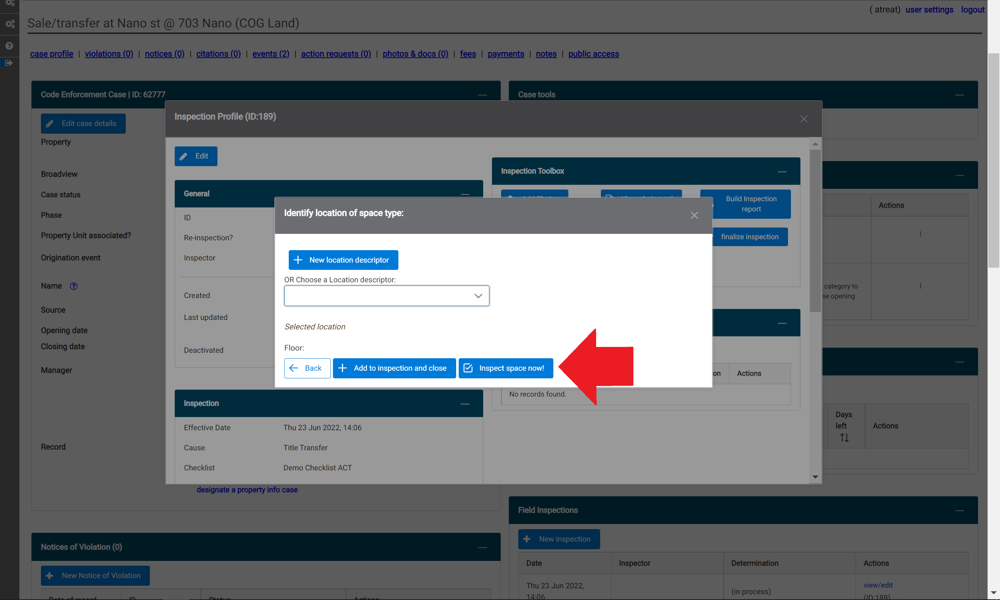

(7) All of the code elements within the inspection list will default to 'Not Inspected'. If you would like, you can batch apply the 'Passed' or 'Violated' status to all of the code elements in the list by selecting the status from the drop-down menu in the top left-hand side of the pop-up window and select the 'Batch apply to all ords' link.

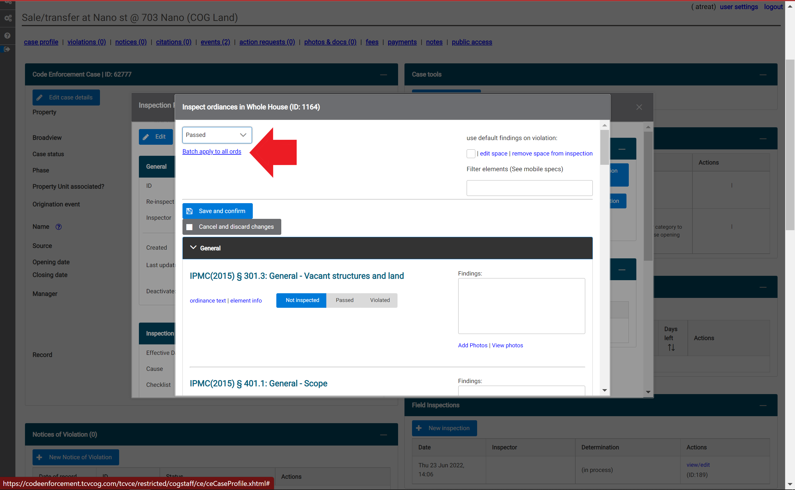

(8) Code elements in the inspection list are divided into subcategories. Select the arrow next to a subcategory (red circle) to display the associated code elements.  To add a photo, select the 'Add a photo' link (red arrow). 

(9) After selecting the 'Add a photo' link in step 8, a pop-up window will appear. To add a photo that is saved on the device, select the '+ Choose' button. 

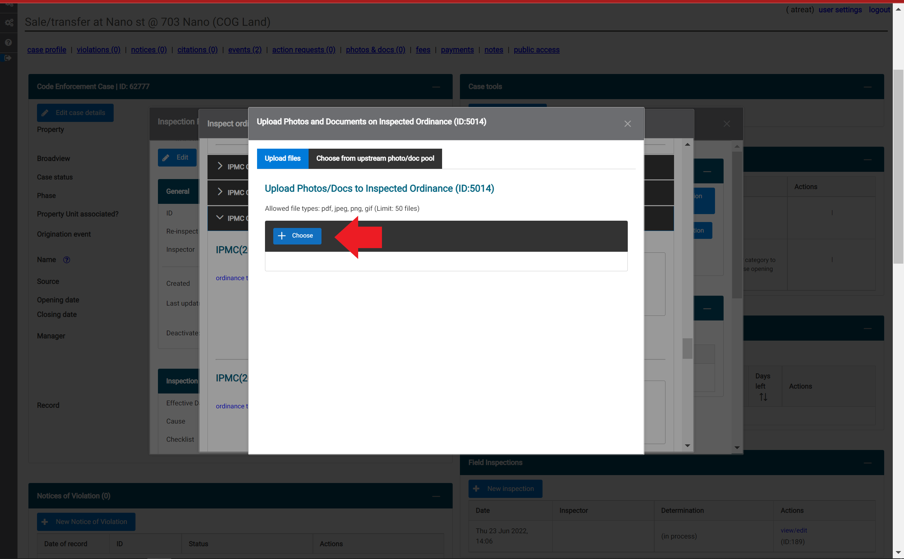

(10) Once you are done selecting files, click the blue 'Upload' button. 

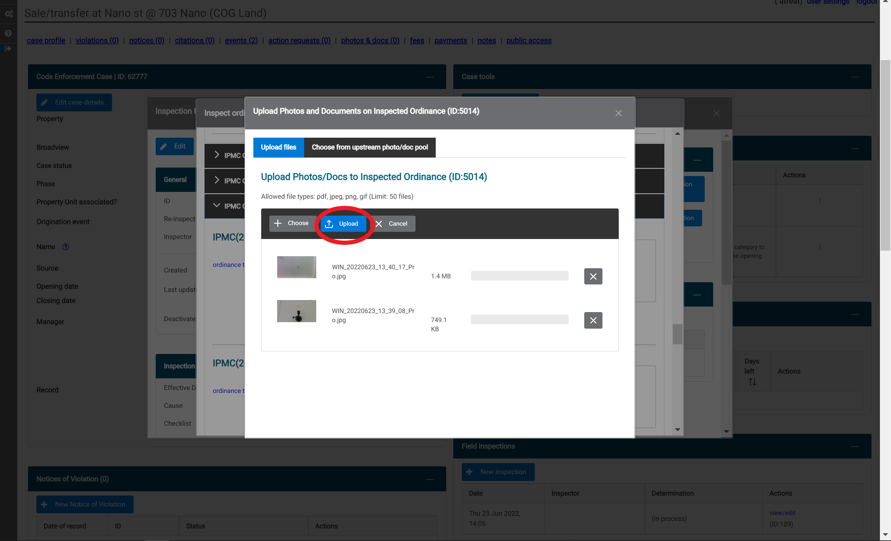

If your upload is successful, the blue 'Upload' button will dissapear and confirmation will temporarily appear for each file that was uploaded. 

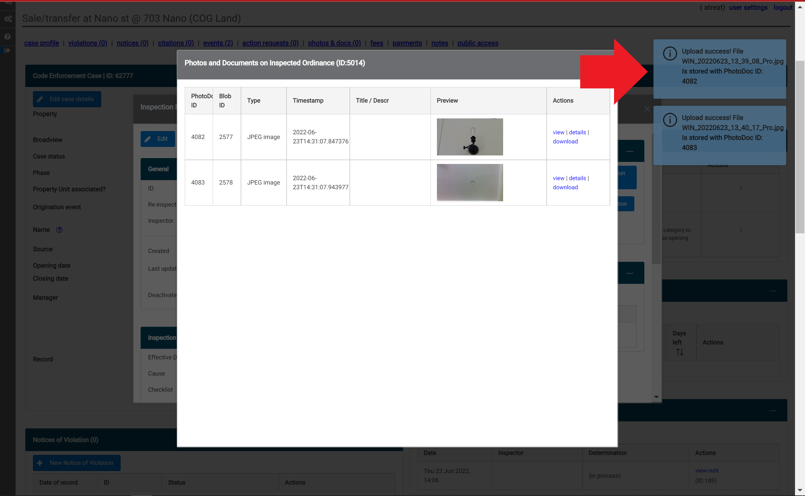

(11) To complete the inspection checklist, select 'Save and confirm' at the top of the window. 

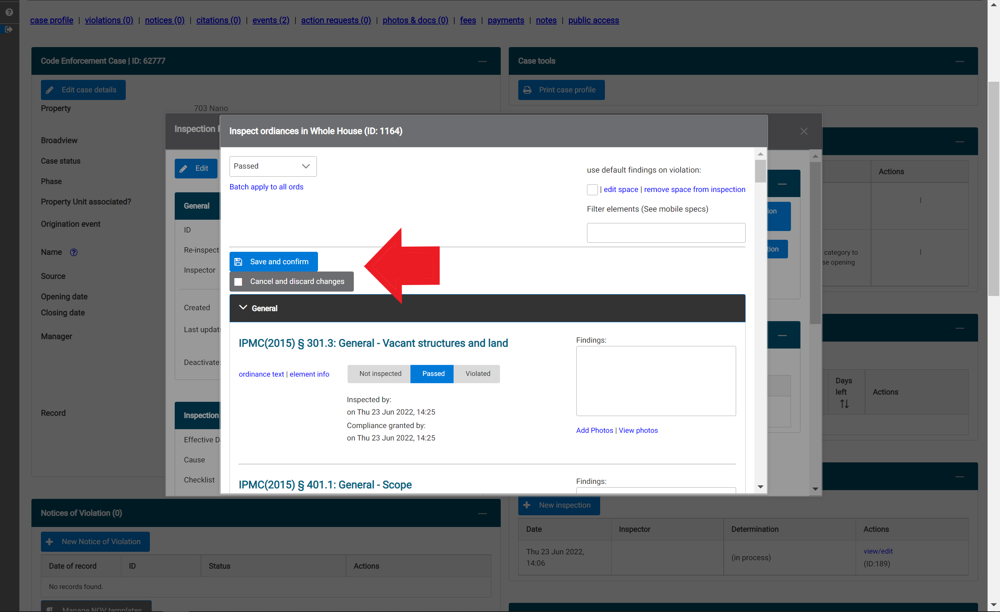

(12) If the inspection contained any violations, a pop-up window will appear to prompt you to indicate the severity. Choose the appropiate severyity from the drop-down menu, then select 'Save violation details'.  

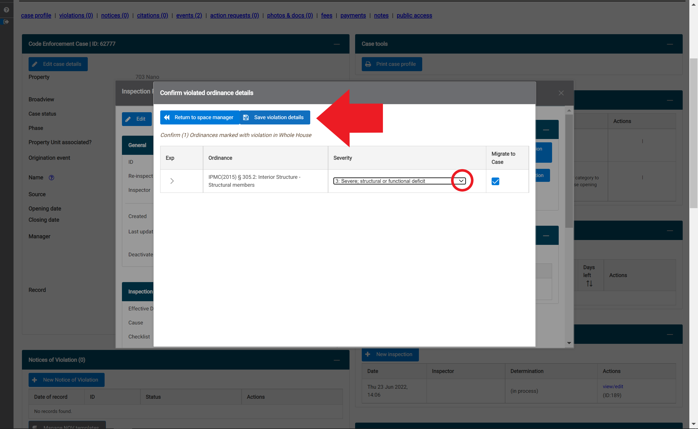

## Inspection Toolbox {#toolbox}

The Inspection Toolbox contains options to:

- [Finalize your inspection](#Finalize-an-Inspection)
- [Build a printable inspection report](#Generate-a-Field-Inspection-Report)
- [Transfer inspected violations to a new or existing case](#Add-Inspected-Violations-to-Case)

## Finalize an Inspection

(1) After saving an inspection checklist, you can finalize the inspection by selecting the blue 'finalize inspection' button. 

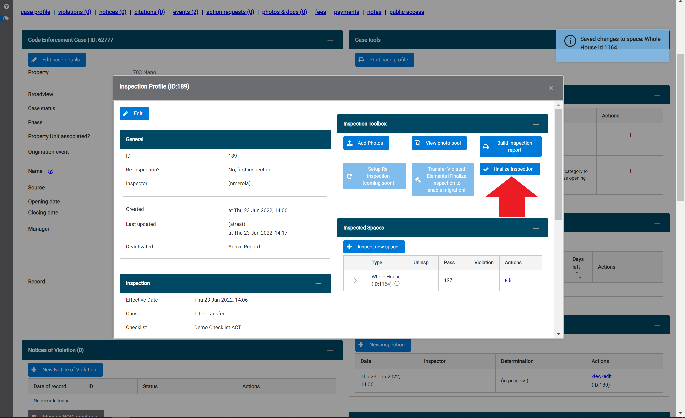

(2) Select the correct determination/result of the inspection from the drop-down menu by clicking the down arrow. Then select the 'Finalize and lock inspection ID' blue button. After this button has been selected, you will no longer be able to make any changes to the inspection.

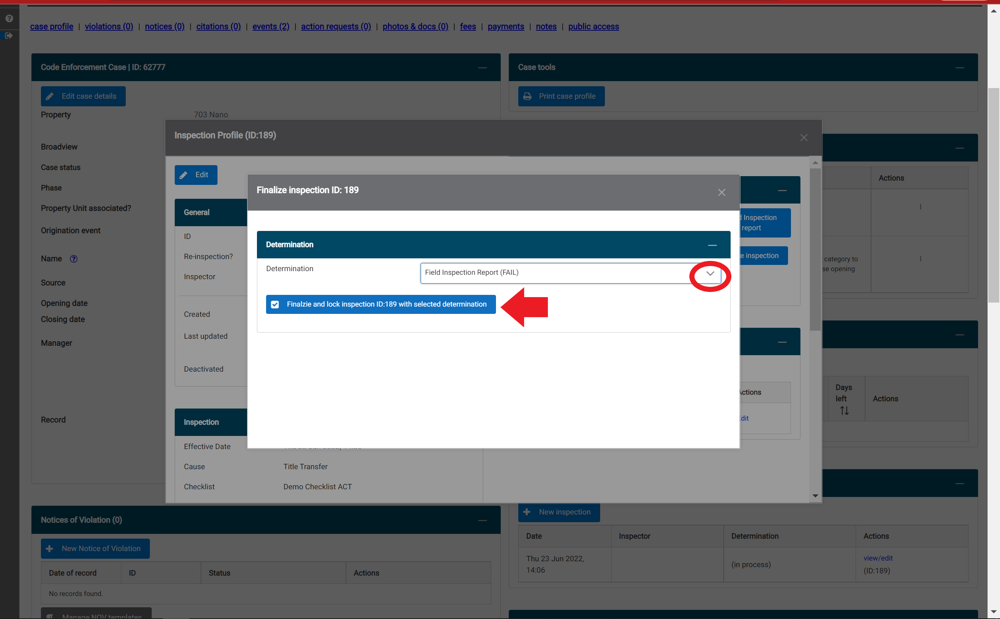

## Generate a Field Inspection Report

(1) Select the blue 'Build Inspection Report' button (red arrow).

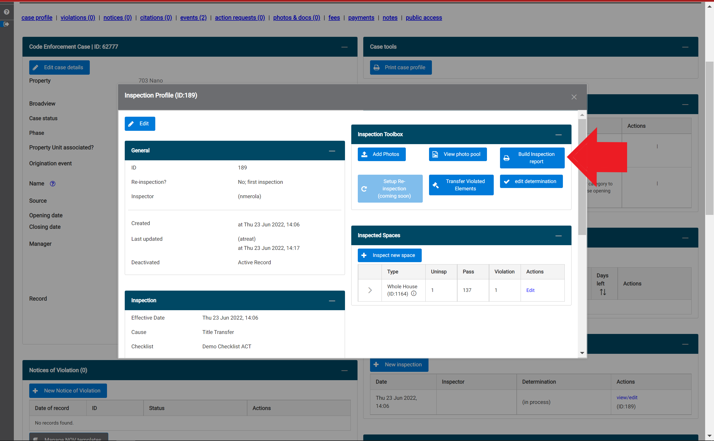

(2) Select which elements of the inspection you want to be included in the report from the drop-down menu (red circle) and check any relevant boxes.  Once you are finished, click the 'Click to generate inspection report in new tabe' blue text at the top of the pop-up window. The report will appear in a new tab in a print-friendly format. (Note: It is recommended to remove Headers and Footers on your print settings and adjust the scale as needed.)

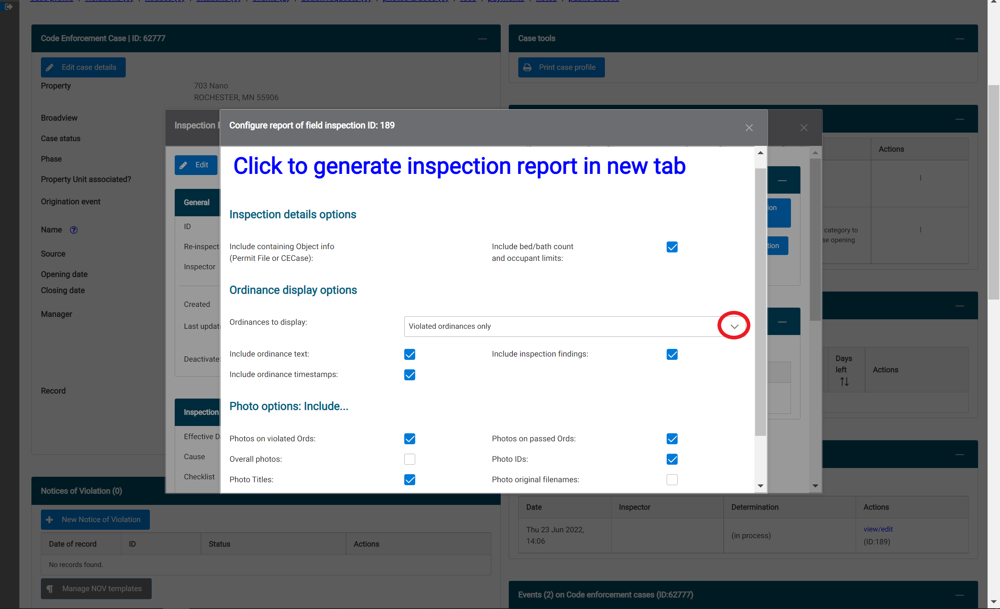

## Add Inspected Violations to Case

(1) After an inspection has been finalized, you can transfer the violations that were found to your case so that you do not need to re-enter them. To do this, select 'Transfer Violated Elements' in the Inspection Toolbox.

(2) Select that you would like to add violations to an existing case.

(3) Review the violations and enter case details to complete the transfer.

