## Permit Files

From this page, you can conduct an occupancy inspection, generate an occupancy permit, and track photos, documents, and events. Each permit is attached to a property unit.

## Conduct An Inspection

1. From the permit file page, select the '+ New inspection' button under the 'Inspections' banner. 

2. Choose the inspection checklist that you want to use and select the 'Create' button.

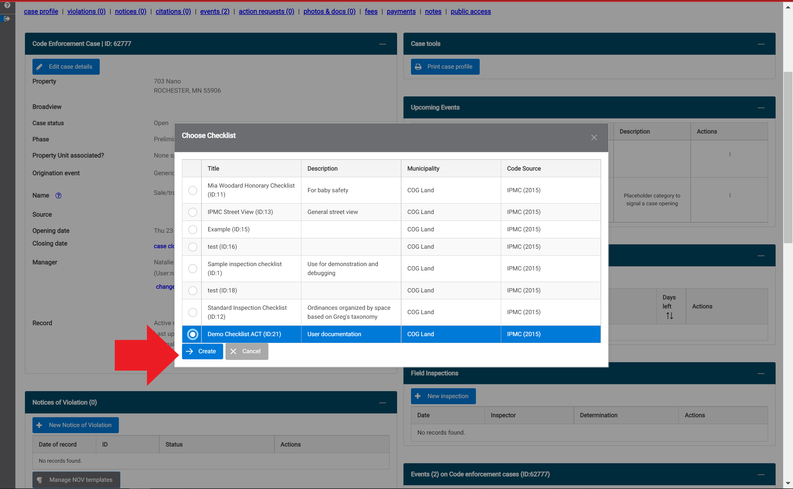

3. Enter the inspector, date, and time of the inspection, and any notes, in the 'Inspection Profile' pop-up window.  Select the 'Save Changes' button.  

4. Select the 'Inspect new space' button.  

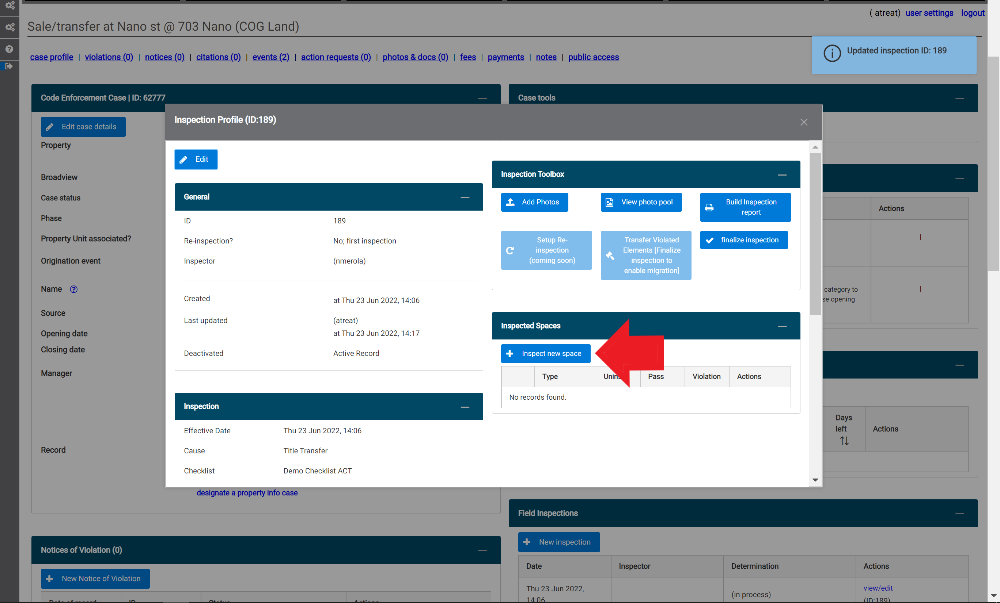

5. Select the space(s) and click 'Continue'.

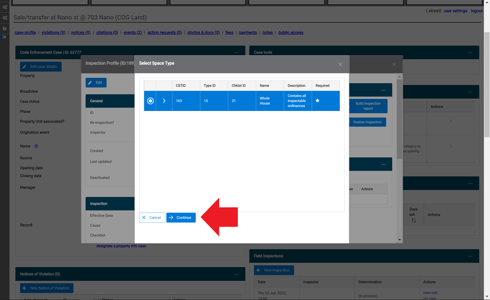

6. You can choose to add a location descriptor. To start the inspection, select the 'Inspect spance now!' button.

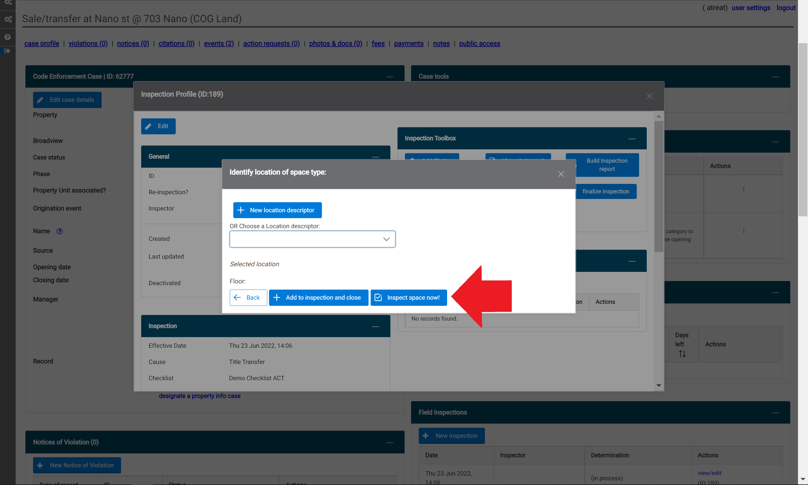

7. All of the code elements within the inspection list will default to 'Not Inspected'. If you would like, you can batch apply the 'Passed' or 'Violated' status to all of the code elements in the list by selecting the status from the drop-down menu in the top left-hand side of the pop-up window and select the 'Batch apply to all ords' link.

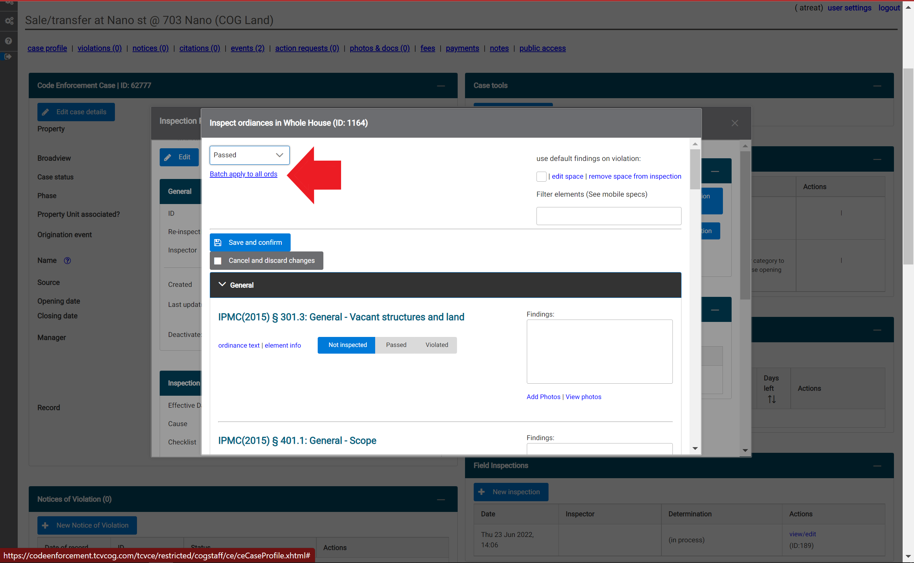

8. Code elements in the inspection list are divided into subcategories. Select the arrow next to a subcategory (red circle) to display the associated code elements.  To add a photo, select the 'Add a photo' link (red arrow). 

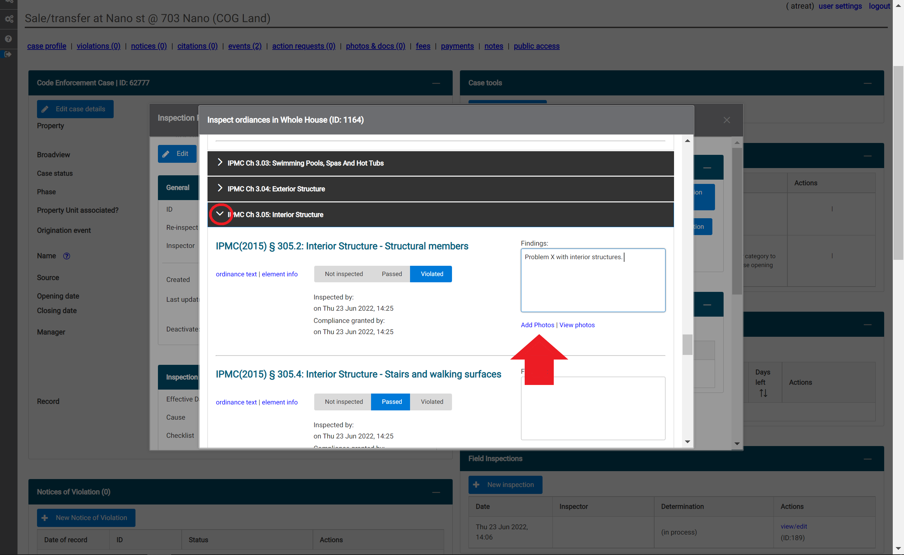

9. After selecting the 'Add a photo' link in step 8, a pop-up window will appear. To add a photo that is saved on the device, select the '+ Choose' button. 

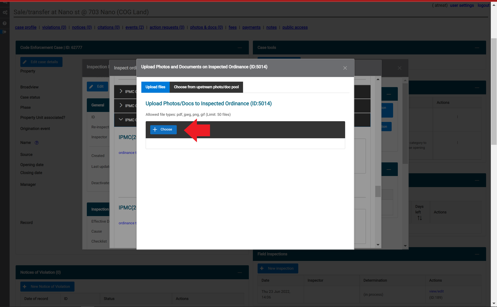

10. Once you are done selecting files, click the blue 'Upload' button. 

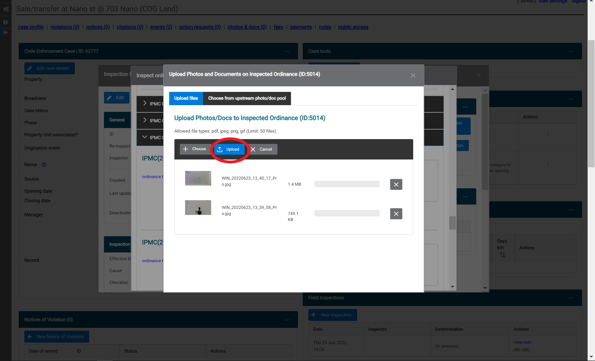

If your upload is successful, the blue 'Upload' button will dissapear and confirmation will temporarily appear for each file that was uploaded. 

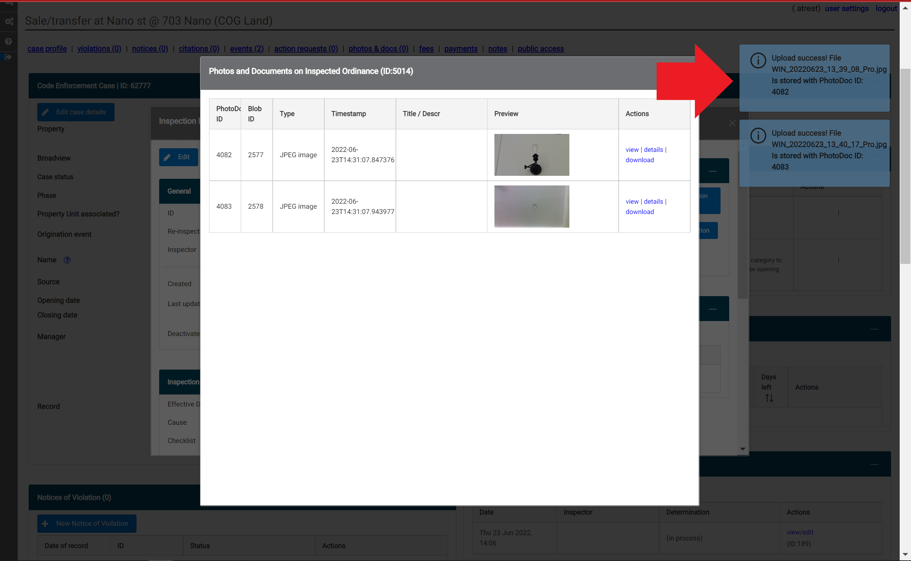

11. To complete the inspection checklist, select 'Save and confirm' at the top of the window. 

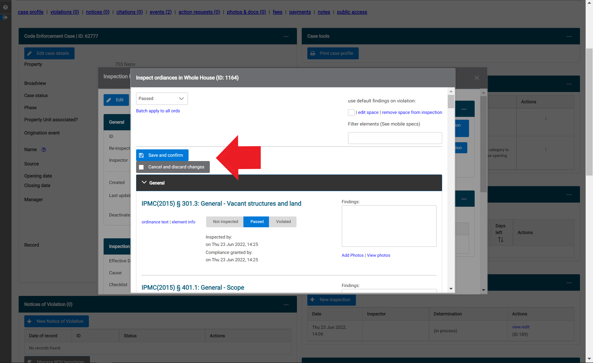

12. If the inspection contained any violations, a pop-up window will appear to prompt you to indicate the severity. Choose the appropiate severyity from the drop-down menu, then select 'Save violation details'.  

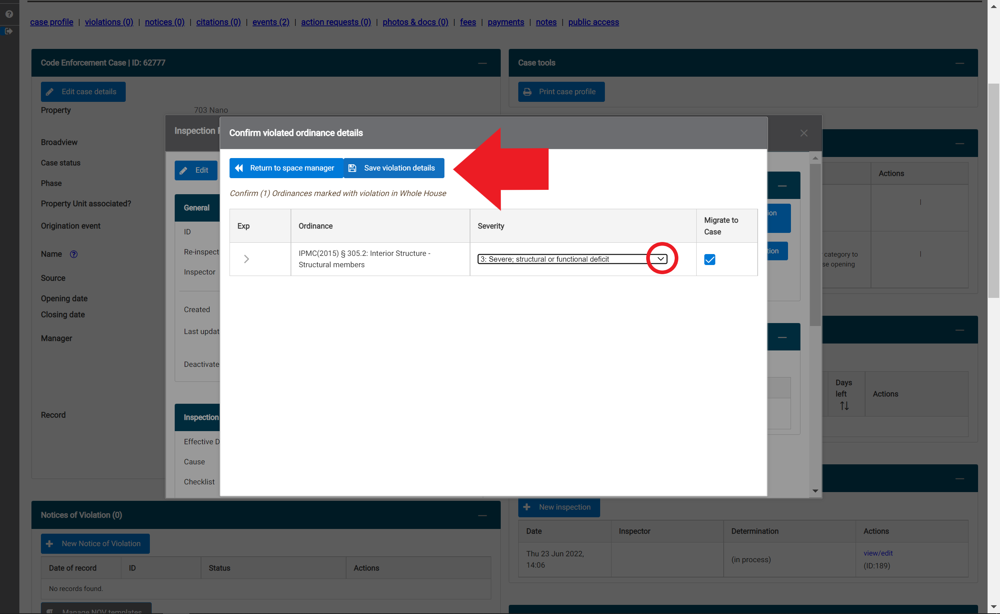

## Finalize an Inspection

1. After saving an inspection checklist, you can finalize the inspection by selecting the blue 'finalize inspection' button. 

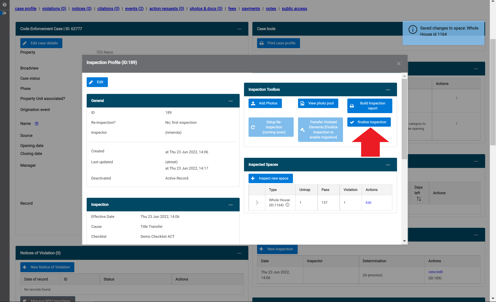

2. Select the correct determination/result of the inspection from the drop-down menu by clicking the down arrow. Then select the 'Finalize and lock inspection ID' blue button. After this button has been selected, you will no longer be able to make any changes to the inspection.

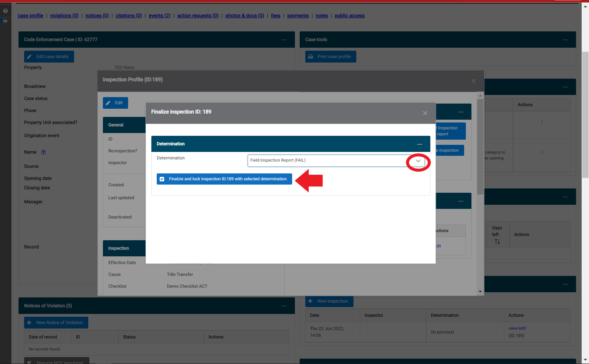

## Generate a Field Inspection Report

1. Select the blue 'Build Inspection Report' button (red arrow).

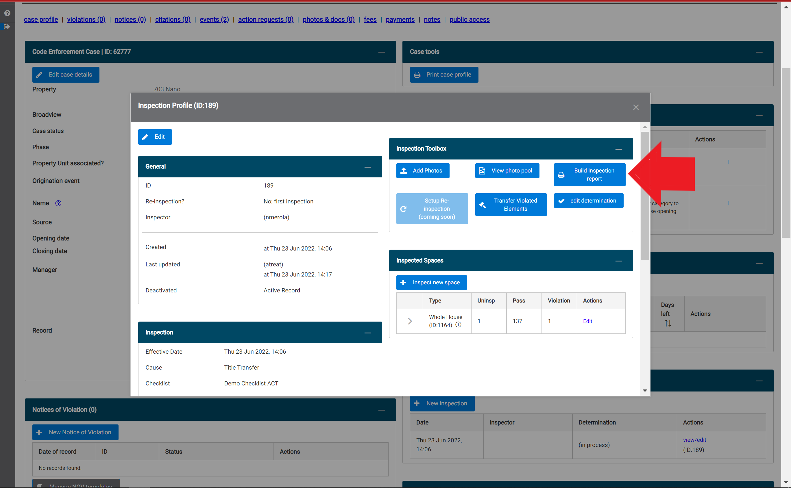

2. Select which elements of the inspection you want to be included in the report from the drop-down menu (red circle) and check any relevant boxes.  Once you are finished, click the 'Click to generate inspection report in new tabe' blue text at the top of the pop-up window. The report will appear in a new tab in a print-friendly format. (Note: It is recommended to remove Headers and Footers on your print settings and adjust the scale as needed.)

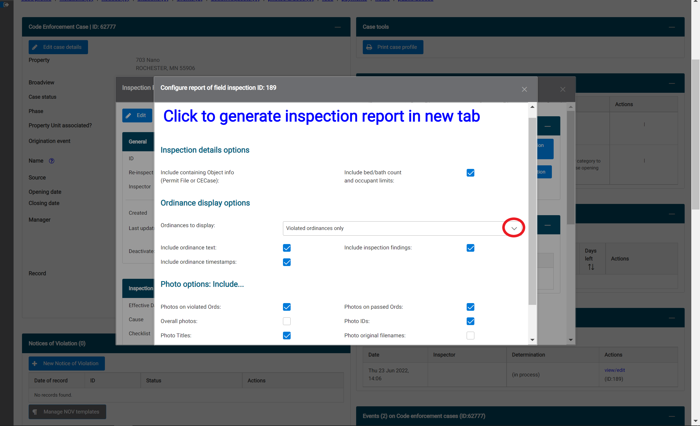

## Transfer Violations to a New or Existing Case

1. After an inspection has been finalized, you can transfer the violations that were found to a new or existing case so that you do not need to re-enter them. To do this, select 'Transfer Violated Elements' in the Inspection Toolbox.

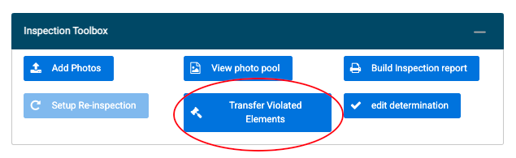

2. Choose whether you would like to open a new case, or add the violations to an existing case.

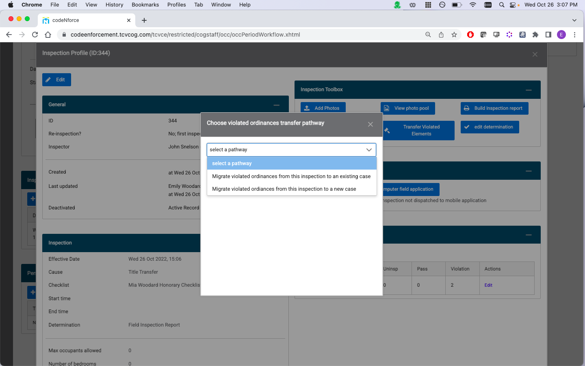

3. Review the violations and enter case details to complete the transfer.

## Generate an Occupancy Permit

