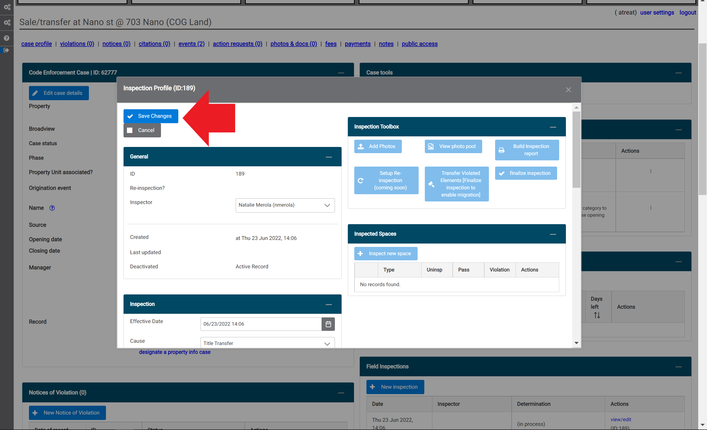

## Create A Checklist 

1. Select the 'checklist' link in the 'Code Book' section of the dashboard. 

2. Select the '+ New checklist' button on the inspection checlist builder page. 

A pop-up window will appear in the middle of the page. 

3. Fill in the municipality, title, description, and governing code for the new checklist that you want to create. Then, select "Save Changes". 

***The default municipality in this pop-up window may not be the municipality you are currently logged into! Choose the desired municipality from the drop-down menu. The checklist you create will only appear for the municipality chosen in this field!***

4. After saving the basic information for your new checklist in step 3, the "Save Changes" button will dissapear, but the pop-up window will remain. At this point you can either edit the basic information (red arrow), or exit the window (red circle). 

5. The new checklist you created should appear at the bottom of the inspection checklist builder for the municipality you chose in step 3. If not, refresh the webpage.

Select the 'load checklist' link to continue building the checklist. 

After clicking the 'load checklist' link, the title of the new checklist should appear on the right hand side. Now you are ready to add items to your list! 

6.  Select the '+ Add Space Type' button. 

This will generate a pop-up window that prompts you to choose one or more spaces to add to your checklist. You can also choose to make the spaces that you are adding to the checklist required (red circle). Note, that the 'required' flag will be added to ALL of the spaces you chose in this window.  However, you can change a required space into an optional space later (see step 8).

When you are done, scroll down to the bottom of the list of spaces and click the 'Add selected spaces to checklist' button. 

7.  You should now be able to see all of the spaces you selected and link the associated ordinances that apply to each space. Select the 'link ordances' link in the 'Actions' section of the space.

A pop-up window listing all the related code elements from the governing code you selected in step 3.  To read a description of the code element, click the arrow symbol on the left-hand side of the code element (red circle). 

Select the code element(s) you want to link to the space by clicking the empty box next to the 'ID' of that code element. You can also select all of the code elements in the list by clicking the box in the header of the windw (red circle). You can also mark a code element as required by checking the box in the 'Required' column on the right-hand side. 

When you are done selecting code elements, select the 'Connect selected ordinances to space type: ' button (red arrow).

8. Double checking and editing your new list. 

You can confirm which code element(s) were linked to each space in your checklist by selecting the arrow on the left-hand side of the inspection space (red circle). You can also 'remove' a space or mark a required space as 'optional' using the links on the right-hand side of the space (red box). 

## Conduct An Inspection

1. From the permit file page, select the '+ New inspection' button under the 'Inspections' banner. 

2. Choose the inspection checklist that you want to use and select the 'Create' button.

3. Enter the inspector, date, and time of the inspection, and any notes, in the 'Inspection Profile' pop-up window.  Select the 'Save Changes' button.  

4. Select the 'Inspect new space' button.  

5. Select the space(s) and click 'Continue'.

6. You can choose to add a location descriptor. To start the inspection, select the 'Inspect spance now!' button.

7. All of the code elements within the inspection list will default to 'Not Inspected'. If you would like, you can batch apply the 'Passed' or 'Violated' status to all of the code elements in the list by selecting the status from the drop-down menu in the top left-hand side of the pop-up window and select the 'Batch apply to all ords' link.

8. Code elements in the inspection list are divided into subcategories. Select the arrow next to a subcategory (red circle) to display the associated code elements.  To add a photo, select the 'Add a photo' link (red arrow). 

9. After selecting the 'Add a photo' link in step 8, a pop-up window will appear. To add a photo that is saved on the device, select the '+ Choose' button. 

10. Once you are done selecting files, click the blue 'Upload' button. 

If your upload is successful, the blue 'Upload' button will dissapear and confirmation will temporarily appear for each file that was uploaded. 

11. To complete the inspection checklist, select 'Save and confirm' at the top of the window. 

12. If the inspection contained any violations, a pop-up window will appear to prompt you to indicate the severity. Choose the appropiate severyity from the drop-down menu, then select 'Save violation details'.  

## Finalize an Inspection

1. After saving an inspection checklist, you can finalize the inspection by selecting the blue 'finalize inspection' button. 

2. Select the correct determination/result of the inspection from the drop-down menu by clicking the down arrow. Then select the 'Finalize and lock inspection ID' blue button. After this button has been selected, you will no longer be able to make any changes to the inspection.

## Generate a Field Inspection Report

1. Select the blue 'Build Inspection Report' button (red arrow).

2. Select which elements of the inspection you want to be included in the report from the drop-down menu (red circle) and check any relevant boxes.  Once you are finished, click the 'Click to generate inspection report in new tabe' blue text at the top of the pop-up window. The report will appear in a new tab in a print-friendly format. (Note: It is recommended to remove Headers and Footers on your print settings and adjust the scale as needed.)

## Transfer Violations to a New or Existing Case

1. After an inspection has been finalized, you can transfer the violations that were found to a new or existing case so that you do not need to re-enter them. To do this, select 'Transfer Violated Elements' in the Inspection Toolbox.

2. Choose whether you would like to open a new case, or add the violations to an existing case.

3. Review the violations and enter case details to complete the transfer.

