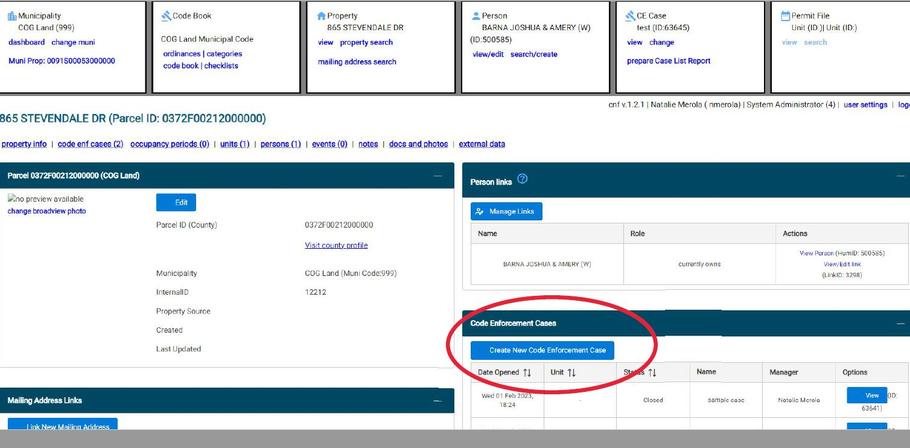
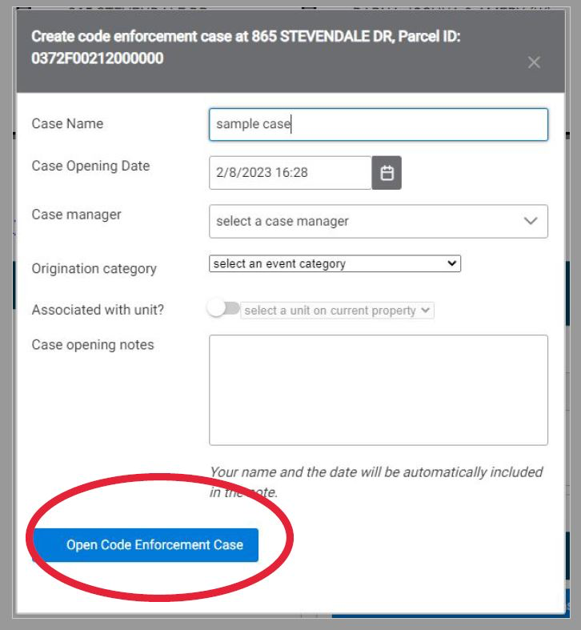

## Open a New Case

(1) Navigate to the property that will be attached to the case. Click 'Create New Code Enforcement Case'.

(2) Enter case details in the pop up box. Under Origination Category, select where the information about the potential violations came from. If the case is attached to a specific unit, toggle the box next to "Associated with unit?" and select that unit. Add any notes to provide more details about background on the case. Then, click 'Open Code Enforcement Case'.

