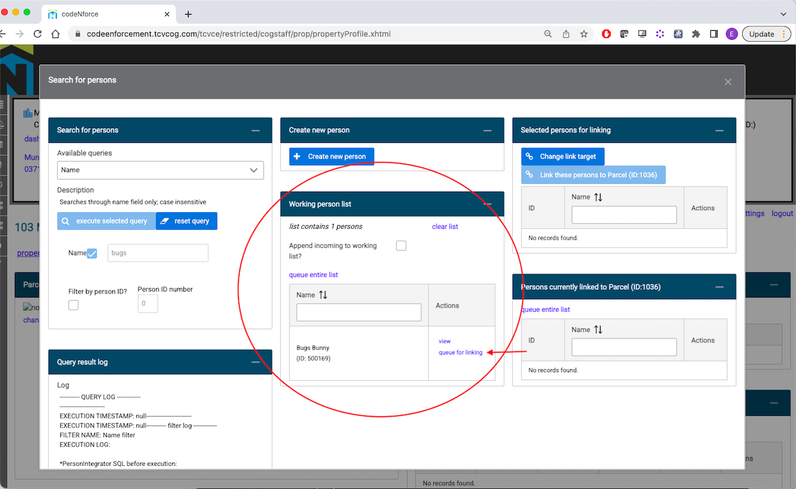
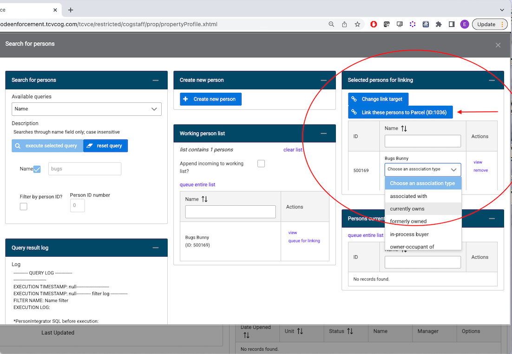
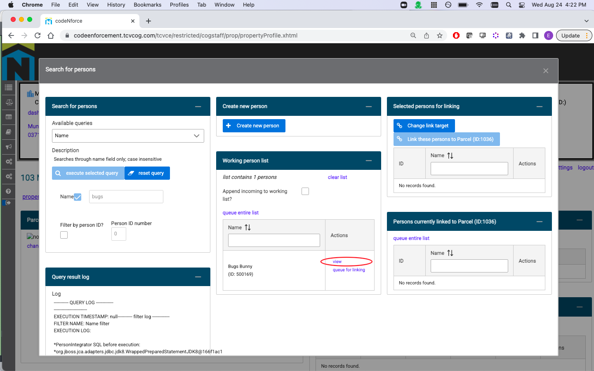
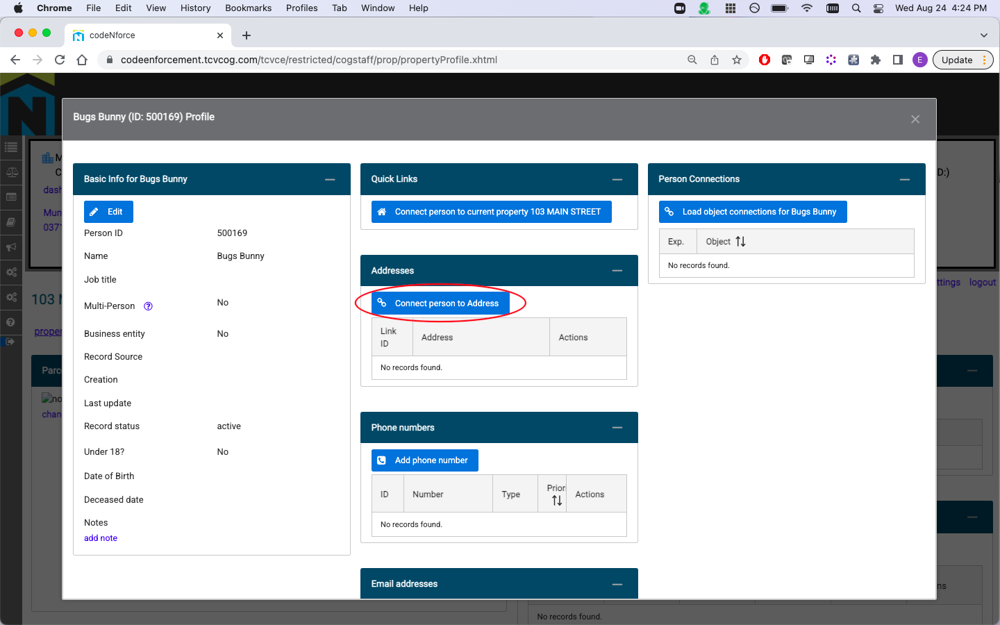
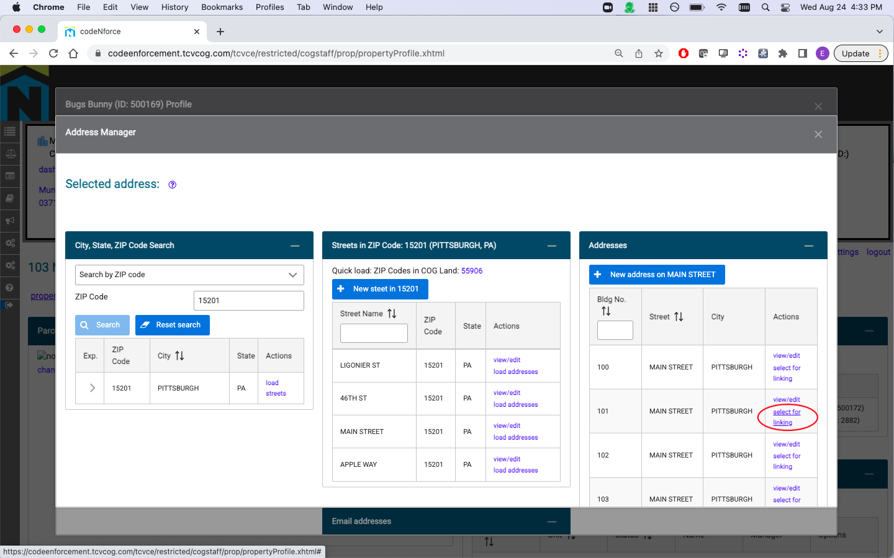

## Link a Person to a Property or Case

<iframe src="https://player.vimeo.com/video/716185487?h=1c6fdf8389&amp;badge=0&amp;autopause=0&amp;player_id=0&amp;app_id=58479" frameborder="0" allow="autoplay; fullscreen; picture-in-picture" allowfullscreen style="position:absolute;top:0;left:0;width:100%;height:100%;" title="Updating Property-Persons Links"></iframe>

1. From the property page, select 'Manage property-persons links'. Or, from the case page, select 'Manage CE Case to person links'.

2. Search to see if the person you would like to connect has already been entered into the database. Type the first or last name into the text block, and select 'execute selected query'.

3. If the person you searched for has not been entered in the database, an error message will display in the top right corner, and no one will appear on the Working Person List. To add this person to the database, select 'Create New Person'.

4. If the person you searched for has been entered in the database, they will display in the Working Persons list. Once you have found them on the list, select 'queue for linking'.

5. Select the person's role (how they are related to the property or case) and then click 'Link these persons to Parcel' or 'Link these persons to Code Enf Case'.

## Link Multiple People to a Property or Case at Once

To link multiple people to a property or case in one batch, complete the steps in 1-4 above for all persons you would like to link. Then, select their roles from the dropdown menus by their name and click 'Link these parcels to Parcel' or 'Link these persons to Code Enf Case'.

## Link a Person to a Mailing Address

<iframe src="https://player.vimeo.com/video/716185588?h=4605c1992d&amp;badge=0&amp;autopause=0&amp;player_id=0&amp;app_id=58479" frameborder="0" allow="autoplay; fullscreen; picture-in-picture" allowfullscreen style="position:absolute;top:0;left:0;width:100%;height:100%;" title="Linking a Person to a Mailing Address"></iframe>

1. If the perosn you want to link is currently displayed in the top navigation bar, select 'view/edit' and skip to step #4. 

If the person you want to link is not currently displayed in the top navigation bar, click 'search/create'. 

2. Type the first or last name of the person you would like to select into the text block and click 'execute selected query'.

3. On the Working Persons List, select 'view' next to the person that you would like to link to the mailing address.

4. Select 'Connect person to address'.

5. Enter the address's zip code and press search. When the result displays, select 'load streets'.

6. Locate the address's street on the results list and select 'load addresses'.

7. Locate the address on the results list and select 'select for linking'.

8. Two buttons will appear at the top of the screen. Click the second button to link your selected person to the mailing address.

9. Identify the connection your person has to the property in the dropdown menu next to 'Role'. Enter any notes, and select 'Save changes'.

## Mark a Property as Abandoned

<iframe src="https://player.vimeo.com/video/752602521?h=4891cd3ca6&amp;badge=0&amp;autopause=0&amp;player_id=0&amp;app_id=58479" frameborder="0" allow="autoplay; fullscreen; picture-in-picture" allowfullscreen style="position:absolute;top:0;left:0;width:100%;height:100%;" title="Marking a Property Abandoned"></iframe>

