# Public action request portal (CEARs)

Contents:
1. [Public CEAR submission sequence](#public-page-sequence)
2. [Internal CEAR management tools](#internal-cear-management-tools)

codeNforce version 1.6.0 and later includes a public-facing series of forms which allows users to submit a code enforcement action request (CEAR). The submission process provides the following features:
* Requests are attributable to either a specific parcel in the chosen municipality or a location describable in a text box.
* Users categorize their requests into simple bins such as "Tall grass" or "Excessive trash" or "Other / not listed" and can flag the issue as relating to human safety
* Photo and document uploads are permitted (3 max)
* Requesters are required to include their name and either an email address or phone number (or both)
* A 6-digit control code is provided on a confirmation screen for easy location of their request when calling for follow-up

## Public page sequence
The following sections focus on each phase of the submission process with details aimed at municipal staff, support staff, and code officers who support public users and internal users reviewing the submitted requests

### Step 1: Begin and choose municipality
The CEAR submission begins with a link in the left side bar of the codeNforce home page. The only input for step 1 is a selection of the municipality in which the concern exists.

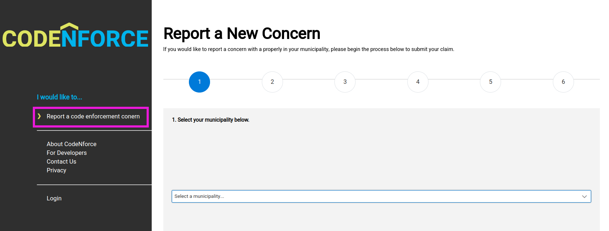

### Step 2: Choose property or describe location
Step 2 asks users to search for and select a property in the selected municipality. Underneath the property search results is a prompt and check box for cases in which the property of concern cannot be found or the concern is not at a specific property. 

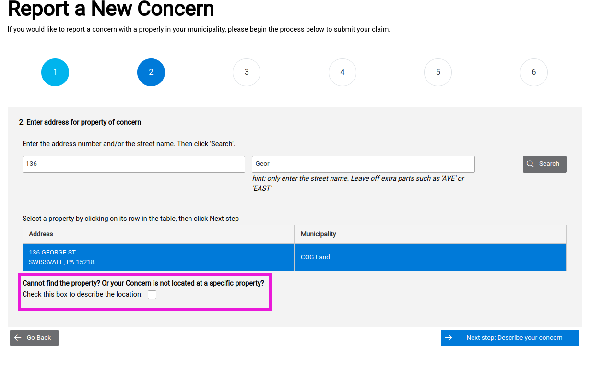

When the check box is enabled, the property search components is replaced by a text input box to capture a free-form description of the concern location.

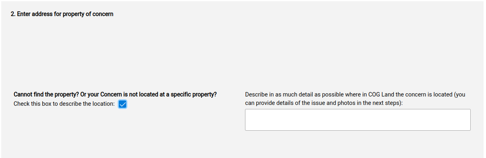

As of v1.6.0, users who do select a property AND check the box for "not located at a specific property" will not receive an error. During internal review both the linked properties and the described location will be displayed.

### Step 3: Describe concern
Users are asked to choose from a short list of general concern categories, including an "other" option. Users can also turn on a "human safety hazard" flag whose only function on the internal review process is to append their description with the words ""

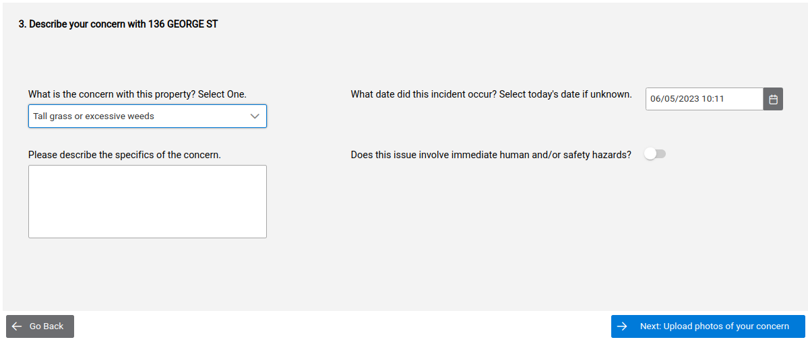

### Step 4: Photos or documents
Users can attach up to 3 photos or documents of to their concern and can describe those objects with a description of 100 characters or less.

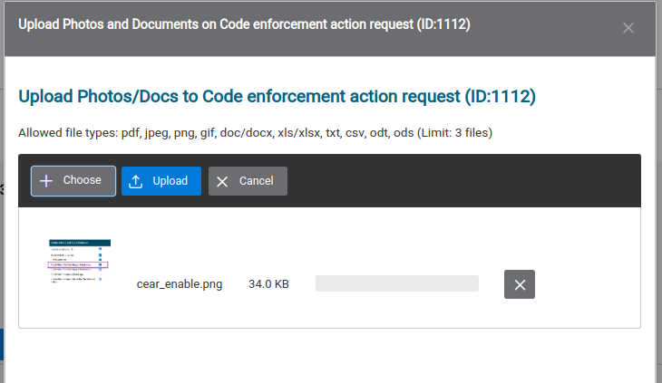
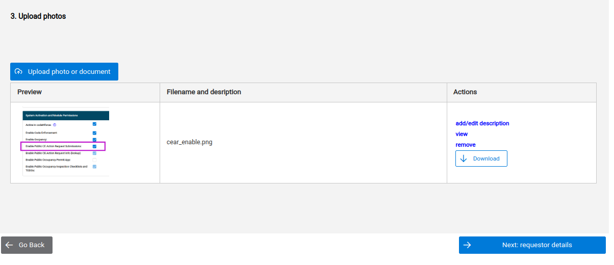
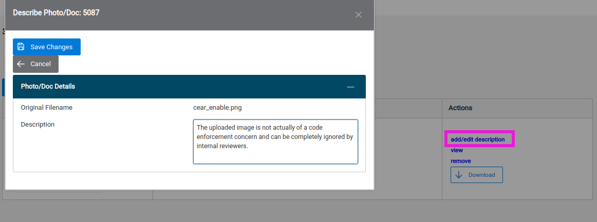

### Step 5: Requester details
If users of any rank except public are logged in to codeNforce when completing the CEAR form, step 5 will display a big blue button extending across the top of the content box that says "You're logged in! Submit this request as yourself: [displays your person name and user name]".

Clicking this button will skip the need to complete the requester info form and dump you directly on the review and submit screen. 

Users not logged in do not see this big blue button and instead must complete at least the Full name field and either the phone number or email field (or both)

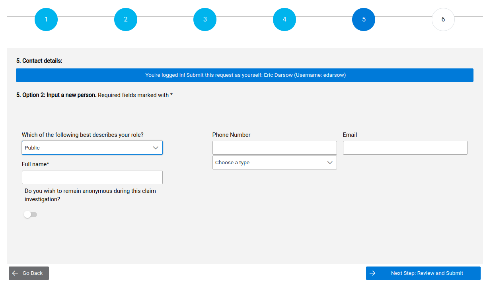

### Step 6: Review and submit
The final step displays a compilation of all their form data from steps 1-5 in a single page with links to jump back and edit any of their form info.

Note that by this step, the user's form data has already been written to the database and assigned both an internal ID and a public access code. (In fact, the database receives the request after property selection--step 2--and then updates the record with additional info during each step's "next" button click.) 

Thus even without clicking the final submit button internal users will be notified of the action request. In fact, internal users see no difference in the request info between requesters who click through all the way to the final submission screen and those who stop after adding their contact information.

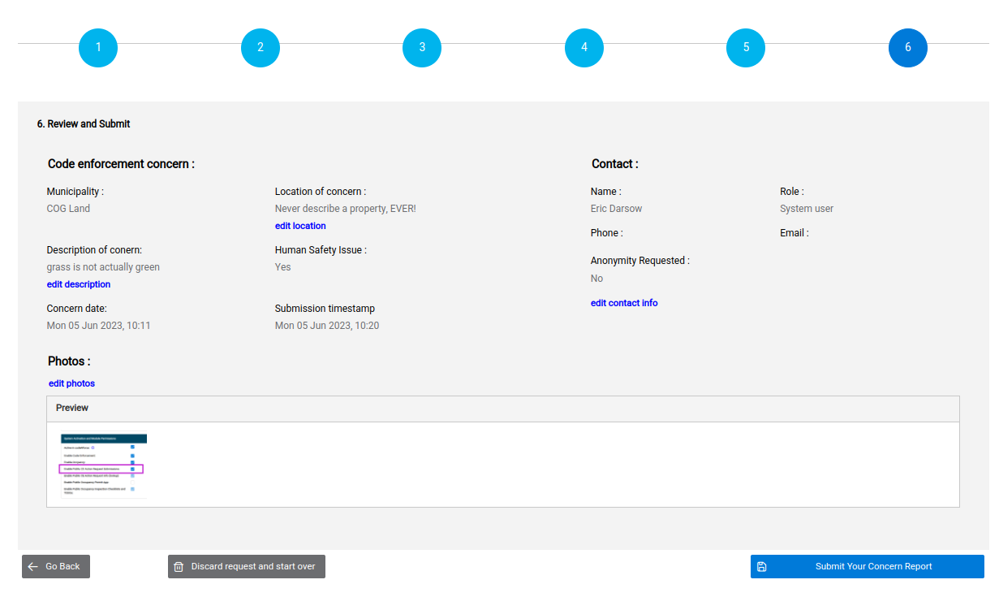

### Confirmation
After confirming request details, users are provided a random 6 digit integer for comfort. This number can be used by internal users to look up the action request regardless of its routing status.

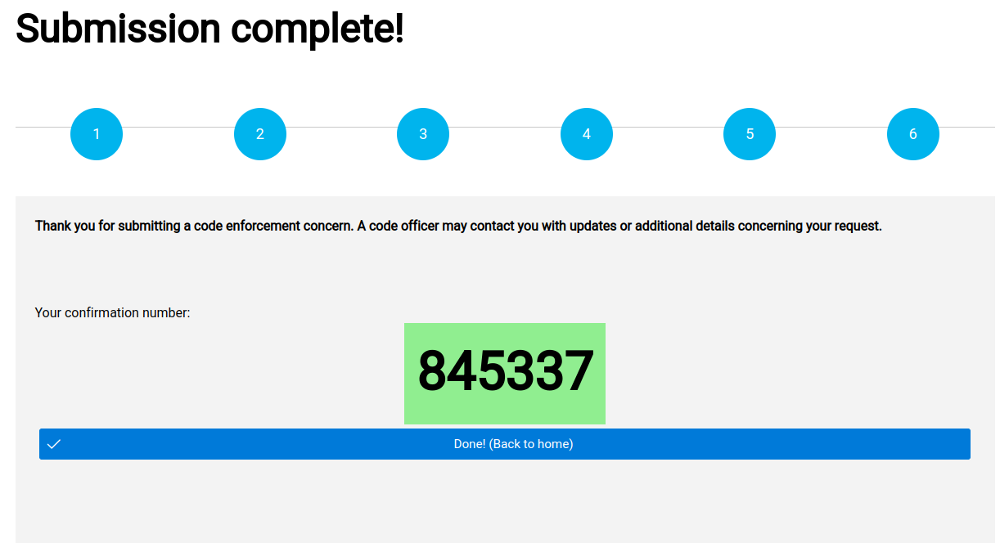

## Internal CEAR management tools

### CEAR alerts in session bar and CEAR panel
Once an action request is submitted using the public form (or, more accurately, as soon as step 2 is completed), the CEAR will be automatically picked up by the automatic query and a red alert will appear at the bottom of the CE Case session box:

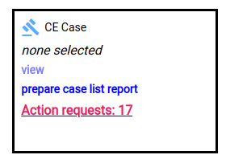

Clicking this alert jumps the user down to the CE Action Requests panel which contains the comprehensive search tool which on session initialization defaults to displaying CEARs that have not been routed or "reviewed" by anybody. 

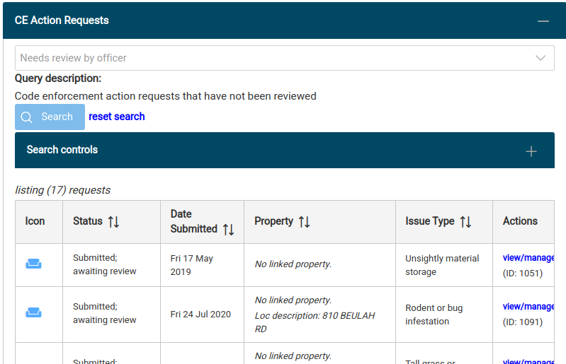

### Viewing a submitted CEAR
View all the form data and routing information associated with a CEAR by clicking the link `view/manage` in the Actions column of the CEAR search results table. This will display the CEAR info dialog containing all the data entered into the CEAR request form sequence, tools for changing the CEAR's property link, the CEAR routing panel, any attached photos or documents, linked persons, and a deactivation tool.

### CEAR-Property link
Requests may be linked to a single property, or no property at all. For example, study the last two records in the following table of CEARs that all need processing. Request ID 1111 second up from the bottom is currently linked to a property whose mailing address is 3823 HENLY DR and as a result the address is a link to that property's profile page. The last request in the list, however, has not been linked to a property and so `No linked property` is displayed in the Property column.

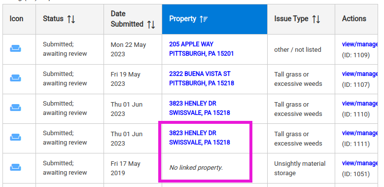

During request processing, officers should determine if the concern is actually at a particular property or not (which might occur if the concern is on a public right of way or on a property without a mailing address). 

If the CEAR in question needs to be assigned to a property or a different property:
1. Locate the target property using the usual `property search` tool in the session Property box at the top of every codeNforce screen. View that property's info page, making that property your session property.
2. Go back and view/manage the CEAR whose property link you wish to make to your current session's property. You can ONLY link a CEAR to the one property that is displayed in your session's Property box.
3. In this example, you can see that request 1105 has no data displayed to the right of "Property" reflecting that it is not linked to any property. Since we've found 3722 HENLY DR and it is our session property, we can update this CEAR's property link by clicking `edit property link`. 
4. We only have two options at this stage: confirm that this CEAR 1105 should be linked to our session property of 3722 HENLY DR or cancel the operation. If we confirm, the link is saved to the DB and the property field reflects the new link and an automatically generated note is appended to the CEAR's  note field.

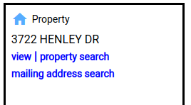
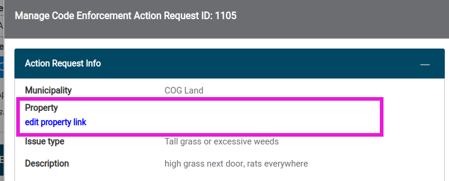
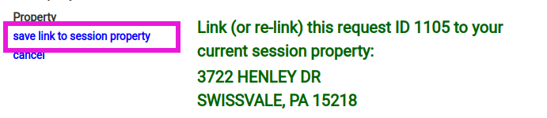
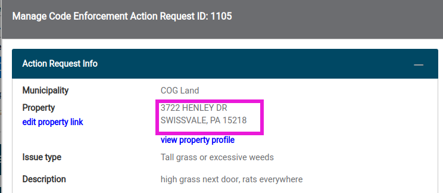

### Routing a CEAR
As soon as a CEAR is submitted using the public form, the CEAR is assigned the status `Submitted; awaiting review` and is therefore ready for routing. Routing involves reviewing the CEAR's content and undertaking the most appropriate of the four possible processing routes. Any of these four routing outcomes will remove the CEAR from its initial status and will no longer be included in the dashboards action request count.

#### The four processing routes:

1. Assignment to an existing CE case on the CEAR's linked property
2. Creating a new CE case on the CEAR's linked property and assigning the CEAR to that case
3. Declaring the CEAR is invalid or incomplete with a short note
4. Declaring that the CEAR requests action on a situation that has been deemed NOT to be a violation of municipal code with a short note

#### To route a CEAR: 
1. Click the `view/manage` link in the right-most Actions column of the request table for the request you wish to route. This will display the CEAR info dialog.
2. Review the content of the submitted request using the left-side panel of the dialog. Drive around a bit and assess the assigned location for code violations. Take some photos. In particular, check the property to which the CEAR is linked, if any. [Update the linked property](#CEAR-Property-link) at this step if the link is incorrect.
3. Choose the desired route from the drop-down box in the upper right panel called Request Routing.
4. Click `route action request`
5. Confirm your selected route
6. Complete the dialog that appears next which will be specific to your chosen route.

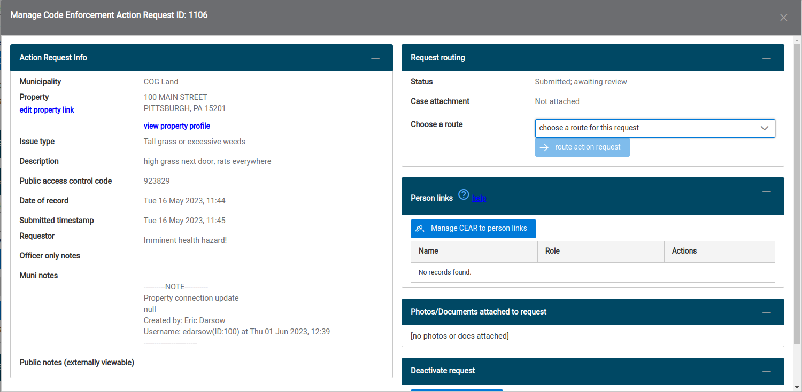
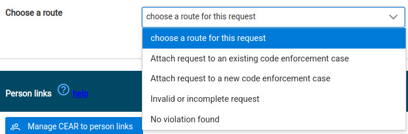
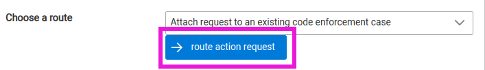
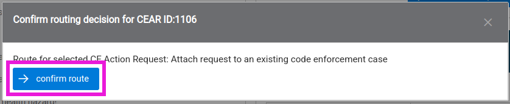

#### Route detail: Assign to an existing case
When this route is chosen, upon confirmation, you'll see a dialog loaded with all cases of all statuses assigned to the CEAR's linked property. For example, 100 MAIN STREET has 4 existing cases to which CEAR 1106 can be assigned. 

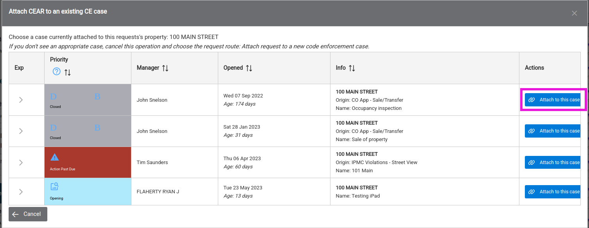

After the assignment to the existing case, the CEAR info dialog is now active and the upper right panel reflects your routing action. Note that you can re-route the request if you chose the incorrect route.

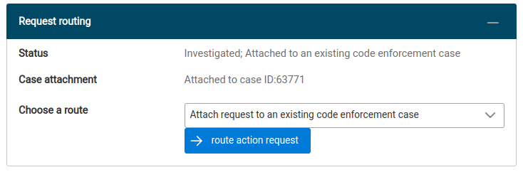

#### Route detail: Assign to a new CE Case
After confirming this route, users are given the standard case creation dialog that is ordinarily accessed from the property info page. Note in the below screen capture, users are encouraged to select the Origination category called `Online Action Request Form`.

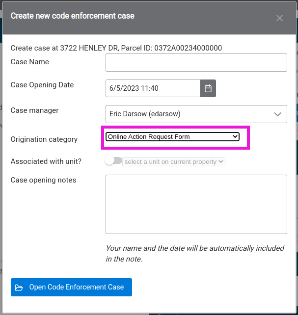

#### Route detail: Invalid request
Routing requests as invalid will prompt the user to write in a text box why the request is invalid. Upon completion of this step, the request will still be visible on its linked property. If the request wasn't linked to a property, the request can be fished out again using the search tool.

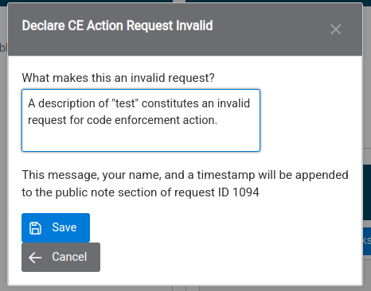

#### Route detail: No violation found
If officers investigate the request and find there is no violation on which to build a CE case the proper route would be "No violation found" which will prompt the user to enter text relating to why the request was routed this way. 

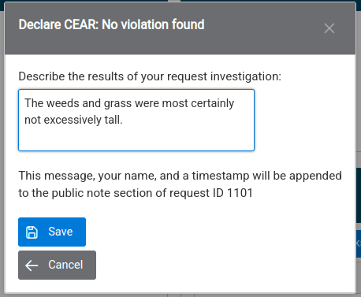

### Searching for requests
The CEAR panel contains a comprehensive suite of tools for searching action requests. Users are encouraged to select the query called `Custom configuration` and then expand the panel called `Search controls` and study the many available search features. 

#### Searching for a CEAR by public access control code
When users submit a CEAR on the public portal they are provided a 6-digit integer code for tracking. Internal users can retrieve requests using that code alone regardless of request status by selecting the query called `Query by public access control code (PACC)`. When this query is selected, suers enter the code into the input box inside Search controls and click `Search`. The matching request(s) will appear in the results and the request can be viewed or routed as needed.

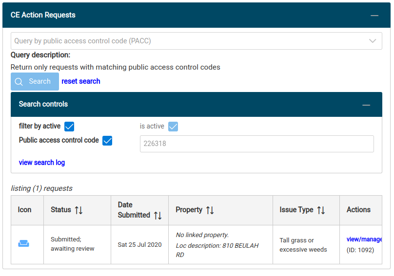

## TODO sections
* Person linking
* Search options
* Deactivation