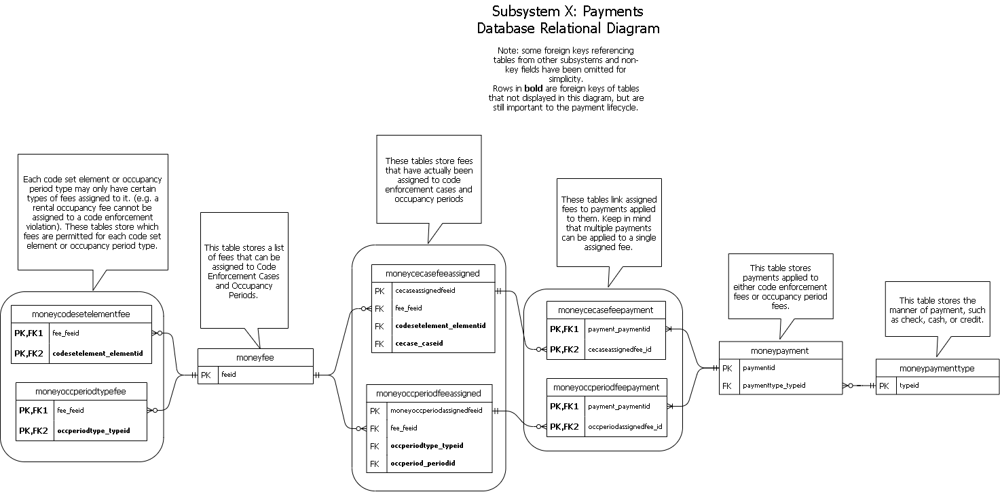

# Subsystem  X Payments

&lt;- [home](index.md)

## Payment team
A mighty and fearless team of one: Mr. Nathan Dietz!

## Diagrams

Here are some diagrams that can help explain the Payments subsystem:

First of all, here's a relational diagram for the database:

Next is a class diagram that explains the various Java objects that represent items in the database:

