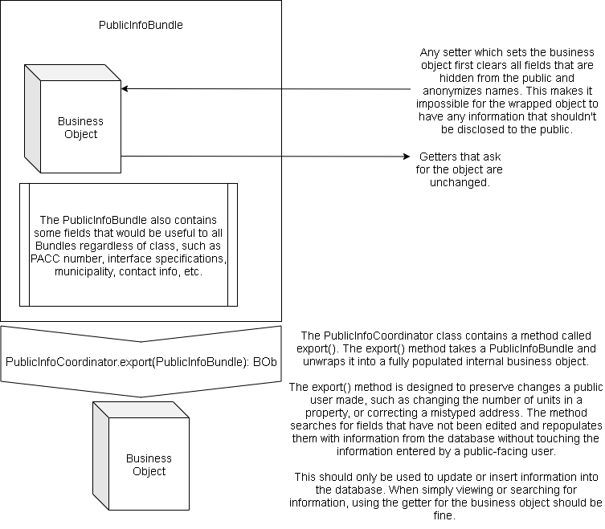

# Subsystem XIII Public information

&lt;- [home](index.md)

## Overview
The "public" means a user on the site who has not authenticated with a Username and password. Individuals who have involvement in a Code enforcement case or are a party in any way to a occupancy period should be able to
1. Access basic information about The status of their case/period
2. Retrieve a human name with a phone number to contact with questions
3. Add notes, messages, updates, or photographs to applicable items (A CE Case, an inspeection) 

## Subcomponents
1. Code enforcement action request status lookup: For folks who have complained about an issue by filing an online request for CE action, they can use a 6-digit control code to see their action request and perhaps any associated CE cases

## Access a InfoBundle through a PACC
A PACC is a public access control code that allows for retrieval of information about any number of codeNforce objects. This is a stand-in for a full logon; as long as that PACC is enabled, it can retrieve info that is packaged inside of a `PublicInfoBundle` subclass

## Design goals (unfinished components)
1. Track each use of each PACC as an event on an associated object; e.g. when somebody views the status of a code enforcement case against their neighbor, the internal user should see an EventCnF appear on that case's internal event history

## PublicInfoBundles as a wrapper class
In our newest approach, we are going to use PublicInfoBundles as a wrapper class that contains a filtered BOb that can be viewed or edited by a public user!

