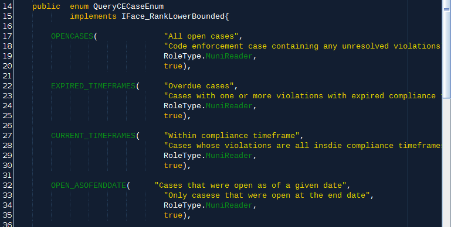

# Subsystem  XIV Search

&lt;- [home](index.md)

The core idea of searching the database: every listing of database objects (CECase, Person, Property, etc.) is built using a SQL query that's assembled based on the configuration of a passed in `SearchParams` subclass, such as `SearchParamsCEActionRequests`.

`SearchParams` objects store various search parameter values that are injected into `SELECT` statements and switches that turn each one on and off.

To use the search utility:
1. Call the appropriate factory method on the `SearchCoordinator` for the default `SearchParams` subclass you want, such as `getDefaultSearchParamsCEActionRequests()`. This will usually happen by a backing bean or perhaps even the domain coordinator.
2. Customize the default configuration of the `SearchParams` object you get back.
3. Usually this will be used on page load to build a starting list for display
3. Wire the backing bean properties to the various parameters on your search object so the user can tinker with them
4. Use the `SearchParams` object to shuttle revisions on the initial query to the integrator.

## Case study: Creating a Violation search utility
This case study will enact the steps required to build a search tool for the Violation objects directly. As of this writing, search object sub-families exist for code enforcement cases through a query of `CECase` objects. Clients need to demonstrate value and the primary means of doing so is violation compliance metrics. Querying cases and then extracting their Violations in Java is sub-optimal, since we'll probably miss violations that still exist on cases that don't get pulled up in our case queries.

### Actors involved in searching

#### `SearchCoordinator`
Responsible for initializing all Queries and their parameters, as well managing the actual execution of Queries against the database, the `SearchCoordinator`'s methods will form the basis for our build out.

#### `SearchParams` subclasses
These folks store the actual switches used by our integration classes for writing SQL to shoot down to the database.

#### `QueryXXXEnum` family
Queries of an object such as `Person` or `CECase` are configured using rules attached to enum values stored in each search pathway's governing `QueryXXXEnum` class.

This clip of the top of our [`QueryCECaseEnum`](https://github.com/TechnologyRediscovery/codenforce/blob/recovered/src/main/java/com/tcvcog/tcvce/entities/search/QueryCECaseEnum.java) class will be our template for `QueryViolationEnum`:

#### `QueryXXX`

Our primary aggregation object of these search-related classes is the `QueryXXX` class, all subclasses of `Query`. They all contain an identifying enum value, a `List` of `SearchParamXXX` objects, and the actual bob result list assembled by our clunky and finicky (by oh so faithful) integrators.

### Step 1: Build `QueryCodeViolation`

Using `QueryCECaseEnum` as a template, let's create a `QueryCodeViolation` which we'll use to store all of our related objects.

A refactor copy operation in NetBeans allows a smooth templating.

The key task here is to modify the member variable types to match our `CodeViolation` related sublcasses. We'll build those objects as we do this so our type-checking system can watch our six.

#### Step 1A: Creating `QueryCodeViolationEnum`

Refactored version of `QueryCECaseEnum`. We'll review those members in a moment; for now, we just need to class to exist to modify our `QueryViolation`.

#### Step 1B: Creating `SearchParamsCodeViolation`

The second member of `QueryCodeViolation` is a `List<SearchParamsCodeViolation>`. We adapted `SearchParamsCECase` to create this new subclass of `SearchParms`. 

This is a list because a given query might require building and running a few separate `SELECT` statements against the database. For example, we might want a list of violations that were created OR cited during a period. Since we'll be building the SQL statement programatically, it's often easier to just "do the union manually" by adding the results of two `SELECT` calls to the same list. 

So: one instance of `SearchParamsCodeViolation` means a single `SELECT` execution, and a single call to the `SearchCoordinator`'s `runQuery` method.

#### Step 1C: Configure Business Object list

The third member of `QueryCodeViolation` is a `List<CodeViolation>` allowing our query object to hold the actual business objects that were returned when each of our parameter objects is run against the db.

### Step 2: Rough in methods on `SearchCoordinator`

Now that we have actual `QueryCodeViolation` objects, duplicate and refactor the applicable `CECase` related methods to work with `QueryCodeViolation`s. Our families of methods on `SearchCoordinator` work together to build and execute queries against the db, in source order:

 * `BuildQueryXXXList` methods: requires the user's `Credential` and uses the permission settings on that as well as those attached to each `QueryXXXEnum` to assemble a list of `Query` objects for a particular business object ready to be customized and sent back to the `SearchCoordinator` for execution. These suckers do this by calling `initParams` inside a for loop over the enum values.
 * `genParams_XXX_YYY` private methods: Primary logic holders of search operations, these puppies are responsible for assembling a single `SearchParamsXXX` subclass with switches set properly to answer a business question. These are called by `buildQueryXXX` methods internally based on the triggered `case`.
 * `initQuery` overrides: logic container for calling `genParamsXXX` for the triggered enum instance.
 * `runQuery` overrides: What we've all been waiting for: the true site of query execution coordination. Calls relevant methods on object integration classes who talk to the db.

### Step 3: Write `searchForCodeViolations` method on integrator

The `CaseIntegrator` will actually build SQL for us inside an elite method of our integrator requiring a single `SearchParamsCodeViolation` instance which it will unpack in some multi-layered logic to build a valid SQL statement

As usual with our business objects, we'll often get back just an ID list that will need to be built into an actual BOb later by the coordinator who makes sure all the business rules are followed.

Use `public List<Integer> searchForCECases(SearchParamsCECase params)` for a template.

#### Iteratively build our SQL and search params

We're ready to get to the guts of the database query. Since we're building the SQL programatically, we'll create member variables on `SearchParamsCodeViolation` to plug into our cascade of logic turning on and off various components of the `SELECT` and creating injection points for values the user wants to use for restricting results.

Note that all queries share utility methods for configuring proper SQL syntax for date range queries and extracting keys from core objects, such as `User` and `Credential`.

We'll rougly have member variables on our `SearchParamsCodeViolation` object that correspond to the database fields, taking joins into account to allow querying across tables. 

#### Note the `SearchParams` superclass
`SearchParamsCodeViolation`'s' parent will manage most of cross applicable field switch holding, such as municipality control, date and user containers, and some schnazzy date utility switches that automatically convert a relative date (34 days ago) into an actual date threshold to use in generating the SQL clause. 

Set #4 in the `SearchParmas` parent is a data restriction facility in which a user can be required to have a certain role to even execute that particular configuration of query switches. Our `SearchCoordinator` will ensure that these rules get followed by forcing query requests against all tables in the system get routed through the type and call pathways which will reject malformed parameters before they hit the integrator. No logic or access restriction logic lives in interators! 

#### Building date and user fields enums

To allow user customized queries, and easy programmatic tweaking of SQL that can be type checked at runtime, the relevant date fields on the DB table map to Java enum values in the`SearchParamsCodeViolationDateFieldsEnum` and the relevant user fields in the  `SearchParamsCodeViolationUserFieldsEnum` class. Each enum value has two members: a human friendly title and the specific database field name. The integrator method we're writing will use these enum member values to write valid SQL to throw against the DB.

Generation note: since `codeviolation` is a first generation db table, it doesn't conform to the date and user field standard implemented by the humanization database process described elsewhere. This means future tables should be built such that a shared set of date and user field enums can be used (and extended) which will reduce query logic failures and syntax bugs.

